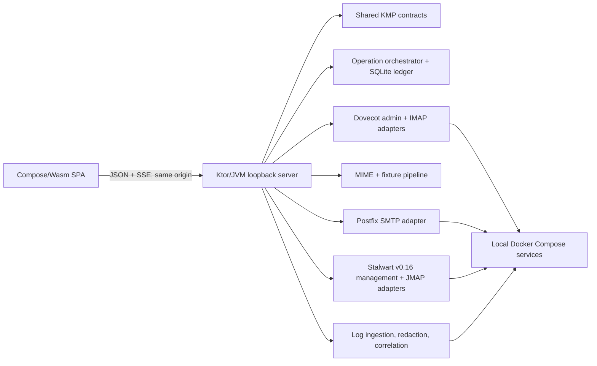

# Debug Dashboard — Design Specification

**Date:** 2026-07-23

**Status:** Design approved; pending implementation planning

**Target:** `debug-dashboard/`

## 1. Goal

Build a local web application that lets one developer administer, exercise, and diagnose the repository's Dovecot and Stalwart mail stores without switching among shell scripts, protocol clients, and container logs.

The first usable release must support all nine requested workflows against both supported provider profiles:

1. inspect server logs;
2. inspect account-related logs;
3. create accounts and select a supported provider/protocol profile;
4. author, import, generate, append, and deliver messages;
5. list, create, and delete folders;
6. list and read messages;
7. change account passwords;
8. delete accounts;
9. mark read/unread, flag/unflag, move, copy, trash, and permanently delete messages.

A disabled baseline action does not count as support. The release remains not ready until the live two-provider acceptance suite passes.

## 2. Product Boundaries

### In scope

- One loopback-only dashboard for the repository's local Docker Compose sandbox.
- Dovecot with IMAP and Postfix SMTP/LMTP.
- Stalwart v0.16.14 with JMAP mail, submission, and JMAP-based management.
- One logical email address with independent Dovecot and Stalwart provider instances.
- Direct mailbox append and real protocol-level delivery as distinct modes.
- Deterministic fixtures, authored text, uploaded EML, random scenarios, and generated threads.
- Live and historical diagnostics with explicit correlation confidence.
- Provider-native identifiers, results, errors, and concurrency semantics.

### Out of scope

- Remote, production, or multi-user administration.
- Implicit synchronization between Dovecot and Stalwart stores.
- Arbitrary Docker, shell, filesystem, or server-management access.
- Enabling arbitrary provider/protocol combinations in the first release.
- POP3, Exchange, or other additional protocol profiles in the first release.
- A general-purpose end-user mail client.
- Stalwart v0.15 dashboard compatibility.
- Making Open Mail Orbit part of the critical path.
- A Gradle, React, TypeScript, npm, or hidden fallback build.

## 3. Approved Decisions

| Area | Decision |
|---|---|
| Operating model | Host-native local application on the same machine as Docker Compose |
| Frontend | Compose Multiplatform/Wasm SPA |
| Backend | Ktor/JVM loopback service |
| Shared code | KMP contracts targeting JVM and `wasmJs` |
| Build | Kotlin Toolchain wrapper and YAML module model only |
| Supported profiles | `dovecot-imap` and `stalwart-jmap` |
| Stalwart baseline | Pin v0.16.14 and migrate before dashboard implementation |
| Logical accounts | Same address, separate provider instances and provider state |
| Message creation | Direct append and true delivery, visibly distinguished |
| Operation model | Durable jobs with provider/item outcomes and reconciliation |
| Visual world | Flight-recorder workbench |
| Defining composition | Evidence Split |

## 4. Direction Contract

**THESIS:** Mail state and the evidence that produced it belong on one instrument panel. The surface refuses both the generic rounded-card admin dashboard and the terminal-shaped neon developer console.

**OWN-WORLD:** Recorder-paper work zones sit inside a graphite powder-coated shell. Dovecot cyan and Stalwart amber mark registered provider channels; a rare red cursor marks destructive risk, failure, or the selected trace position. Keylines, compact labels, tabular notation, and low-radius controls replace floating cards.

**STORY:** Select a logical account, choose a provider channel, perform a mail or account action, inspect its provider-native receipt, and follow the correlated evidence without leaving the workspace.

**FIRST VIEWPORT:** Health spans the top, navigation stays compact at left, mailbox work occupies roughly 62%, and message detail, receipt, and evidence inspector occupy roughly 38%. The recorder strip spans the lower edge.

**FORM:** Grounded direction 4, composition option 2, registration-console staging, seed `a26b17b8`.

The approved north-star comp is included below. It establishes hierarchy, density, and material—not literal dates, IDs, copy, dimensions, or component implementation.


Durable visual rules live in `DESIGN.md`; route-specific strategy lives in `.impeccable/surfaces/debug-dashboard.md`.

## 5. Architecture



The browser never talks directly to a mail server, management endpoint, Docker socket, or host file. All privileged access stays in the Ktor process.

### 5.1 Kotlin Toolchain project

The project is created inside `debug-dashboard/` using the Kotlin Toolchain initializer and checked-in wrapper. Its intended module boundaries are:

```text
debug-dashboard/
├── kotlin
├── project.yaml
├── dashboard-contract/   # kmp/lib: JVM + wasmJs
│   └── module.yaml
├── dashboard-server/     # jvm/app: Ktor, adapters, jobs
│   └── module.yaml
└── dashboard-web/        # wasm-js/app: Compose SPA
    └── module.yaml
```

Exact generated directories may follow the toolchain's current template, but these three ownership boundaries remain.

No Gradle files are added. The checked-in `./kotlin` wrapper is the supported build entry. No task silently invokes Gradle, npm, a generated Node project, React, or TypeScript.

### 5.2 Runtime placement

The Ktor service runs on the host and binds only to `127.0.0.1`. Host placement is required because it:

- serves the compiled Wasm assets and versioned JSON API;
- invokes a fixed allowlist of `docker compose` and `doveadm` operations;
- reads Docker Compose stdout without mounting the Docker socket into another container;
- atomically updates the host-side Dovecot user file;
- connects to the exposed IMAP, SMTP, and JMAP endpoints;
- maintains a local, gitignored operation database and short-lived upload spool.

The service discovers the repository root from validated configuration. Requests cannot supply arbitrary command names, service names, working directories, or filesystem paths.

### 5.3 Module responsibilities

| Unit | Responsibility | Depends on |
|---|---|---|
| `dashboard-contract` | DTOs, provider keys, capabilities, operation states, errors, validation, route constants | Kotlin serialization only |
| `dashboard-web` | Navigation, account workspace, forms, message reader, logs, Trace lens, accessibility | `dashboard-contract`, Ktor client, Compose |
| HTTP/API layer | Same-origin API, CSRF/session checks, SSE, content headers, request validation | application services |
| Account registry | Live projection of provider accounts into logical addresses | account admin adapters |
| Operation orchestrator | Locks, idempotency, progress, cancellation, partial outcomes, reconciliation | ledger and provider adapters |
| Dovecot admin adapter | User-file parsing and atomic mutation, auth-cache flush, session kick, auth verification | host filesystem and allowlisted `doveadm` |
| Dovecot mail adapter | IMAP folder/message reads and mutations with UID semantics | IMAP endpoint |
| Postfix submission adapter | Real SMTP envelope submission and queue receipt capture | SMTP endpoint |
| Stalwart admin adapter | Domain/account query, create, credential update, destroy | v0.16 JMAP management |
| Stalwart mail adapter | Mailbox, Email, Identity, blob, import, and submission operations | discovered JMAP Session |
| Message factory | Text-to-MIME, EML validation, fixtures, deterministic random data, threads | bounded host inputs |
| Log pipeline | Docker log tail/history, optional `x:Log`, parsing, redaction, correlation | allowlisted log sources |

Each adapter returns typed provider results. It does not throw raw protocol output across the application boundary.

## 6. Provider and Account Model

### 6.1 Logical accounts

A logical account is keyed by a canonical full email address. It contains zero or one instance of each supported provider profile:

- `dovecot-imap`;
- `stalwart-jmap`.

The registry is a projection of live provider state, not a second authoritative account database. On startup and explicit refresh, the server:

1. lists eligible Dovecot users;
2. queries eligible Stalwart `Account/User` objects;
3. joins them by canonical address;
4. overlays dashboard operation/reconciliation metadata.

Protected administration or service identities are marked as protected and cannot be edited or deleted through ordinary account workflows.

### 6.2 Capability profiles

The account form presents named profiles, not two unrestricted dropdowns:

| Profile | Access | Administration | Delivery |
|---|---|---|---|
| Dovecot · IMAP | IMAP | passwd-file + `doveadm` | Postfix SMTP |
| Stalwart · JMAP | JMAP mail | v0.16 JMAP management | JMAP `EmailSubmission` |

The UI renders only capabilities returned by the readiness probe. However, every baseline capability in Section 14 is mandatory for a provider to be marked usable.

Additional protocol enablement belongs to a later Server Setup phase. The first release may display discovery information but must not pretend, for example, that the current Stalwart profile exposes IMAP.

### 6.3 Provider-native keys

Provider identity remains explicit:

- IMAP message: account, mailbox, UIDVALIDITY, UID.
- JMAP message: accountId, Email id, and latest Email state.
- IMAP mailbox: account plus encoded mailbox name and delimiter context.
- JMAP mailbox: accountId, Mailbox id, latest Mailbox state, role, and rights.

The shared contract may wrap these in sealed provider-specific types. It must not flatten them to a generic string that loses concurrency meaning.

## 7. Authentication and Credential Strategy

### Browser session

The local browser receives only a same-origin dashboard session. It never receives mail-server administration credentials, operator credentials, recovery secrets, or Docker access.

### Provider administration

- Dovecot administration uses the host user file and allowlisted `doveadm`.
- Stalwart administration uses a protected, server-side v0.16 management identity.

### Mail access

Normal browsing and mutation must not require the dashboard to persist every user's password.

- Dovecot uses a dedicated, localhost-restricted master/operator identity for IMAP access.
- Stalwart uses a protected operator identity with only the permissions needed for account impersonation and JMAP mail operations.

The Dovecot operator approach is a Gate 0C contract test. If the current image cannot support a localhost-restricted master identity without weakening ordinary account authentication, implementation stops for a credential-strategy decision.

The Stalwart operator approach is a Gate 0B contract test. If v0.16.14 cannot provide sufficiently scoped impersonation, implementation stops for a credential-strategy decision. It must not silently start storing user passwords.

Passwords supplied during account creation or reset are request-scoped:

- held only for the active operation and verification probes;
- never written to the dashboard database, log events, error details, browser history, or exports;
- overwritten or released when the operation finishes;
- still stored by the underlying provider according to its own supported credential mechanism.

## 8. API and Event Contract

All endpoints are under `/api/v1`. Resource reads are synchronous; mutations return an operation resource, even when they complete quickly.

| Route family | Purpose |
|---|---|
| `GET /bootstrap` | dashboard version, readiness, capabilities, retention, session metadata |
| `/accounts` | list, inspect, create logical/provider instances |
| `/accounts/{address}/providers/{profile}` | provider detail, credential reset, delete |
| `/mailboxes` | list, create, update, delete |
| `/messages` | query, structured read, raw download |
| `/message-actions` | read/unread, flag/unflag, move, copy, trash, permanent delete |
| `/message-lab` | preview, append, deliver, deterministic generation |
| `/operations` | status, item/provider results, cancellation, retry, reconciliation |
| `/logs` | bounded query across normalized and raw-safe evidence |
| `GET /events` | reconnectable SSE stream for health, jobs, mail refresh, and log events |

Mutation requests include an idempotency key. The server validates it against the operation kind and normalized target; reusing it for a different mutation is rejected.

Errors use a typed problem shape:

- stable dashboard code;
- safe user-facing summary;
- field errors when applicable;
- provider profile and safe native code;
- retryable flag;
- operation and correlation identifiers;
- suggested remediation;
- no unredacted native payload.

SSE events have monotonic local IDs. A reconnect with `Last-Event-ID` resumes from the bounded event buffer when possible and emits an explicit resync event when the gap is no longer retained.

## 9. Operation Model

Every mutation follows:

1. validate normalized intent;
2. probe required capabilities and current state;
3. acquire a per-logical-account mutation lock;
4. create or resume an idempotent operation;
5. execute provider steps;
6. store itemized safe receipts;
7. refresh affected resources;
8. release the lock and publish the terminal event.

Operation states are:

- `accepted`;
- `preflight`;
- `running`;
- `succeeded`;
- `failed`;
- `cancelled`;
- `reconciliationRequired`.

Multi-provider work is a saga, not a distributed transaction. A provider that succeeds is never reported as failed merely because the other provider failed. The dashboard does not hide partial completion with an automatic destructive rollback. It records exact outcomes and offers scoped retry or inspection.

Cancellation is cooperative between provider calls. It cannot interrupt an atomic remote method halfway through. An operation still marked running after a server restart becomes interrupted and is reconciled before it may be retried.

### Local persistence

A gitignored SQLite database stores:

- operation metadata with secrets removed;
- provider/item outcomes and safe native receipts;
- correlation identifiers;
- reconciliation links;
- bounded redacted event history.

Default bounds:

- operation records: 30 days or 10,000 rows, whichever is reached first;
- correlated event cache: 24 hours or 50,000 events;
- uploads and generated raw messages: delete after the job, with a one-hour crash-recovery maximum.

The UI exposes retention status and a deliberate Clear Local History action.

## 10. Core Workflows

### 10.1 Account lifecycle

#### Create

1. Validate canonical address, selected profiles, password policy, domain, and duplicates.
2. Preflight all selected providers before mutating either.
3. Create each provider instance under the account lock.
4. Verify login and baseline capabilities.
5. Refresh the logical registry and publish provider-specific results.

Dovecot creation:

- parse and preserve the existing user-file structure;
- reject delimiter, newline, duplicate, and path-injection input;
- lock with a dedicated lock file;
- write a same-filesystem temporary file, preserve permissions, flush it, and atomically rename;
- flush auth cache as needed and verify authentication.

Stalwart creation:

- discover the management/JMAP endpoint rather than hardcoding `/api`;
- query or create the required `Domain`;
- create `x:Account` with `@type: User`, local-part `name`, `domainId`, User role, inherited permissions, and an internal Password credential;
- verify the user's JMAP Session and required account capabilities;
- ensure a usable submission Identity is available.

#### Change password

The user may reset one or both provider instances with the same new value. Outcomes remain separate.

- Dovecot atomically replaces the target password entry, flushes auth state, kicks active sessions, verifies the new password, and confirms the old password fails.
- Stalwart fetches the target Account, deliberately updates only the Password credential while preserving unrelated credentials, then verifies new/old password behavior.

A password reset does not claim to revoke unrelated OAuth access or refresh tokens unless the provider proves that behavior.

#### Delete

Before deletion, the UI shows:

- selected provider instances;
- mailbox and message counts;
- whether provider data deletion is inherent or optional;
- active reconciliation warnings;
- a typed-address confirmation field.

Stalwart `x:Account/set` destroy is immediate and removes the account's stored data. It is labeled irreversible.

Dovecot account deletion removes authentication and kicks sessions. Optional mailbox purge is a separate explicit choice performed through supported `doveadm` operations, never direct `vmail/` edits.

Deleting one provider retains the logical account if another instance remains.

### 10.2 Message Lab

Sources:

- authored text with structured From/To/Cc/Bcc/Subject fields;
- uploaded EML;
- repository fixture selected only from `mails/`;
- deterministic random scenario with visible seed;
- deterministic multi-message thread.

The server parses and validates MIME, separates envelope recipients from headers, enforces a 25 MiB default upload limit, and provides a raw preview before execution.

Two modes are always separate:

| Provider | Direct append | Real delivery |
|---|---|---|
| Dovecot | allowlisted `doveadm save` to a chosen mailbox | Postfix SMTP envelope submission |
| Stalwart | upload RFC 5322 blob, then `Email/import` | create/import Email, select Identity, then `EmailSubmission/set` |

Receipts identify the actual path and include available Message-ID, queue ID, mailbox/object ID, state, timing, and linked evidence.

JMAP submission success means accepted for submission, not confirmed remote delivery. Later `deliveryStatus` is shown when available. A successful submission with a failed Sent-folder filing is a partial success, not a failed send.

### 10.3 Folder lifecycle

Dovecot:

- list via IMAP with delimiter, subscription, special-use, and hierarchy information;
- create with validated encoded name;
- delete only after child and message-count preview;
- preserve server semantics instead of assuming localized names identify Inbox, Trash, or Sent.

Stalwart:

- list with `Mailbox/get`;
- use `role` for system mailbox meaning and preserve `myRights`;
- create/update/delete with `Mailbox/set` and `ifInState`;
- default deletion uses `onDestroyRemoveEmails: false`;
- destructive removal of orphaned Email objects requires separate confirmation.

### 10.4 Message list and read

Dovecot queries use UID-based paging and retain UIDVALIDITY. Stalwart chains `Email/query` to `Email/get` and keeps query state distinct from Email state.

The reader supports:

- structured headers and address fields;
- plain-text and sanitized HTML alternatives;
- bounded body loading;
- attachment metadata and same-origin download;
- raw RFC 5322 download;
- provider IDs and safe diagnostic metadata.

HTML is sanitized server-side with a maintained allowlist library and rendered in an isolated sandboxed surface. Remote content is blocked by default. Raw messages download with attachment disposition and `nosniff`; they are not injected into the application DOM.

### 10.5 Basic message operations

Baseline single and batch operations:

- mark read/unread;
- flag/unflag;
- move;
- copy;
- move to Trash;
- remove from the current folder where the provider supports membership;
- permanently delete.

Dovecot uses UID commands with UIDVALIDITY. MOVE is required for the baseline profile; broad EXPUNGE is never used as an unsafe fallback.

Stalwart uses `Email/set` keyword and mailbox-membership patches with `ifInState`. Same-account copy adds destination membership when `maxMailboxesPerEmail` allows it. Cross-account `Email/copy` remains explicitly non-atomic when followed by source deletion.

Batch results remain itemized. On stale state or UIDVALIDITY change, the affected resource refreshes, successful items remain applied, and failed selections remain selected for deliberate retry.

## 11. Logs and Correlation

### Sources

- Docker Compose stdout/history for the fixed service allowlist: Dovecot, Postfix, Stalwart, and OAuth mock.
- Stalwart `x:Log/query` and `x:Log/get` when `urn:stalwart:jmap` and permissions are present.

Community-edition structured Log access is optional enrichment; Docker stdout remains the baseline. Enterprise-only trace history, metric history, or live telemetry is not required.

The dashboard never calls `x:Log/set`.

### Normalized event

Each safe event carries:

- timestamp and ingestion cursor;
- service and source;
- level and event kind when derivable;
- account role/address when present;
- operation, Message-ID, queue, session, UID, mailbox, and provider object identifiers when present;
- redacted raw line reference;
- parser version and correlation confidence.

### Confidence

Trace links are labeled:

- **Exact:** the same stable identifier appears in both records.
- **Linked:** a deterministic chain such as operation → Message-ID → queue/session connects them.
- **Time-adjacent:** account and bounded time window suggest a relationship but do not prove it.
- **Unmatched:** displayed only in All Logs.

The UI never promotes time adjacency to an exact link.

Stalwart's documented structured Log filter is text-only. Level, event, and time filtering may be applied to fetched normalized pages, but server-side filter claims require a v0.16.14 probe.

## 12. User Interface

### 12.1 Information architecture

Primary destinations:

- **Overview:** service health, readiness gates, recent operations, reconciliation.
- **Accounts:** logical account registry and the defining Evidence Split workspace.
- **All Logs:** cross-service history/live tail, source/confidence filters, pause, export.
- **Fixture Lab:** repository EML, authored/generated scenarios, seed replay.
- **Operations:** progress, cancellation, retry, provider/item results, reconciliation.
- **Server Setup:** discovered versions, endpoints, profiles, permissions, and later protocol configuration.

### 12.2 Account registry

The registry supports search, profile/status filters, provider capability markers, protected identities, and account create/delete entry points.

Account creation uses a progressive side sheet:

1. address and password;
2. one or both named provider profiles;
3. provider-specific preflight;
4. review and create.

Unsupported combinations are absent, not merely selectable with a warning.

### 12.3 Evidence Split workspace

The wide composition contains:

1. graphite application shell and top health rail;
2. compact left navigation;
3. logical account header with Dovecot and Stalwart channel plates;
4. mailbox and message work area on the left;
5. selected message, provider-native receipt, and vertical evidence inspector on the right;
6. contextual recorder strip across the lower edge.

Only one provider's mailbox state is active at a time; channel plates behave as accessible tabs and retain their independent readiness state.

Moving the selected trace cursor updates the evidence inspector and highlights the related message or operation. Selection is conveyed through text, geometry, and focus—not color alone.

### 12.4 Visual rules

- Recorder Paper and Panel Fog own large working regions.
- Graphite owns shell, rails, and primary actions.
- Cyan and amber mark provider ownership only.
- Red is rare and reserved for the selected trace cursor, failure, or destructive action.
- Monospace is reserved for machine values.
- Panels are flat and keylined; ordinary content is not placed in floating cards.
- No fake knobs, gauges, aviation terminology, neon glow, glass, or decorative waveform animation.

### 12.5 Responsive behavior

Responsive change is structural:

- **Wide:** full Evidence Split, folders, message list, reader/receipt/inspector, and trace all visible.
- **Medium:** folders collapse to a drawer; message list and reader/inspector remain side by side; trace remains docked and resizable.
- **Narrow:** navigation becomes a compact top/bottom destination control; account/provider summary persists; message list, reader, evidence, and trace become an ordered drill-in sequence with clear Back behavior.

The trace is never removed on small screens; it becomes a reachable full-width stage with preserved cursor context.

### 12.6 Accessibility

- All workflows are keyboard-complete.
- Provider tabs, tables/lists, dialogs, menus, and progress use semantic roles available in Compose/Wasm.
- Every control has visible focus.
- Color is never the only state cue.
- Service and operation updates use non-disruptive live regions.
- Motion stays within the Operate-mode 150–250 ms range and conveys state only.
- `prefers-reduced-motion` removes cursor travel and paper-feed transitions while preserving the final linked state.
- HTML message content cannot capture application focus or navigate the top-level page.

## 13. Security and Safety

### Local HTTP boundary

- Bind to loopback only.
- Allowlist Host and Origin.
- Disable CORS.
- Use a same-origin, SameSite session and CSRF token for mutations.
- Set a restrictive Content Security Policy including `frame-ancestors 'none'`.
- Use secure cookie transport whenever the chosen local Stalwart/TLS setup permits it.

### Privilege boundary

- No Docker socket mount.
- No arbitrary subprocess, service, flag, path, or working-directory input.
- Build command arguments from typed allowlisted operations.
- Resolve and validate repository paths before use.
- Repository fixtures are selectable only under `mails/`.
- Temporary uploads use generated names in a dedicated gitignored directory.
- Never modify `vmail/` or `stalwart-data/` directly.

### Content and secret boundary

- Redact passwords, bearer tokens, Basic headers, cookies, recovery credentials, API keys, and known secret fields before storage or broadcast.
- Apply redaction before parsing failures can emit raw payloads.
- Sanitize HTML, block remote content, isolate rendering, and constrain downloads.
- Destructive account, mailbox, and permanent-message deletion require preview plus explicit confirmation.
- Stalwart account deletion and any orphan-removing mailbox deletion are labeled irreversible.

## 14. Release Gates and Acceptance

### Gate 0A — Kotlin Toolchain browser proof

Before feature implementation:

1. `./kotlin build` compiles a minimal Compose/Wasm application to `.wasm` and `.mjs`.
2. Authored HTML loads those assets without Gradle or generated Node tooling.
3. A Ktor/JVM app serves assets and SPA fallback from loopback.
4. History navigation, API calls, SSE reconnect, keyboard/focus semantics, and a production build are verified in a modern WasmGC browser.
5. If Kotlin Toolchain alone cannot support this, work stops for a design decision. There is no hidden fallback.

### Gate 0B — Stalwart v0.16.14 baseline

Before dashboard provider implementation:

1. Pin `stalwartlabs/stalwart` to v0.16.14 rather than `latest`.
2. Back up existing Stalwart state before migration; never edit RocksDB directly.
3. Replace legacy TOML/REST management assumptions with the v0.16 object model.
4. Retain the internal directory so password changes are real; layer OAuth/OIDC as an authentication flow rather than an external account directory.
5. Establish protected management and mail-operator identities.
6. Discover and use the JMAP Session's `apiUrl`, `uploadUrl`, and `downloadUrl`.
7. Contract-test Account/Domain management, password reset, Mailbox/Email mutations, raw import, Identity selection, import-to-submission chaining, structured Log access, and operator impersonation.
8. If scoped impersonation or required Community-edition behavior is unavailable, stop for a design decision.

The existing v0.15 store may be migrated through Stalwart's supported process. A destructive fresh reset is a separate, explicit user choice and is not implied by this spec.

### Gate 0C — Dovecot operator access

Before dashboard provider implementation:

1. Configure a dedicated Dovecot master/operator identity without making it a normal mailbox account.
2. Restrict master-user authentication to the dashboard's loopback access path and retain ordinary per-account authentication.
3. Prove that the operator can list, read, append, and mutate mail for disposable users through supported IMAP or `doveadm` paths.
4. Prove that the operator cannot authenticate through the public user path or expand into arbitrary host commands.
5. Verify that account password changes and deletion do not require the dashboard to retain the user's prior password.
6. If the isolation cannot be demonstrated, stop for a credential-strategy decision.

### Gate 1 — Live parity suite

Against a fresh disposable Compose environment, every row must pass for both profiles:

| Workflow | Dovecot proof | Stalwart proof |
|---|---|---|
| Logs | auth and delivery events appear from stdout | JMAP/mail events appear from stdout; `x:Log` enriches when enabled |
| Account trace | queue/session/account evidence with confidence | account/object/operation evidence with confidence |
| Create | new IMAP login and capabilities | new JMAP Session, internal password, and capabilities |
| Append | message readable after `doveadm save` | message readable after blob upload + `Email/import` |
| Deliver | Postfix accepts and Dovecot stores | `EmailSubmission` accepts and status/filing are truthful |
| Folders | list/create/delete and safety checks | `Mailbox/get/set`, state, rights, and safety checks |
| Read | structured and raw fixture coverage | structured body/blob and raw RFC 5322 coverage |
| Password | new succeeds, old fails, session handling verified | new succeeds, old fails, unrelated credentials preserved |
| Delete | login fails; optional purge behavior explicit | Account gone; irreversible data deletion explicit |
| Mutations | read, flag, move, copy, trash, destroy relist correctly | keyword/membership/destroy results relist correctly |

The suite uses newly generated disposable accounts and never deletes pre-existing developer accounts.

## 15. Testing Strategy

### Unit tests

- address, mailbox, and filename validation;
- user-file parsing and atomic rewrite planning;
- provider-key serialization;
- MIME parsing/generation and deterministic seeds;
- log redaction before and after parsing;
- correlation confidence and identifier chains;
- operation transitions, cancellation boundaries, idempotency, and restart recovery;
- IMAP/JMAP mutation translation;
- error mapping and secret-free serialization.

### Adapter contract tests

- fake-server tests for protocol errors and partial results;
- live Dovecot IMAP/admin tests;
- live Postfix SMTP receipt tests;
- live Stalwart v0.16.14 management/mail/submission tests;
- Stalwart state mismatch, partial `Foo/set`, Identity, Log, and permission behavior;
- Docker log follow/reconnect and service allowlist behavior.

### Browser tests

Browser automation is authored from Kotlin/JVM and invoked through the Kotlin Toolchain, subject to Gate 0A. It covers:

- account creation and provider switching;
- Message Lab append and delivery;
- folder and message actions;
- Evidence Split selection and Trace cursor linkage;
- partial failure and reconciliation;
- keyboard-only navigation;
- focus management, live status, reduced motion, narrow layout;
- HTML sanitization and blocked remote content.

No JavaScript/TypeScript test project is introduced.

### Fault tests

- one provider stops during a two-provider operation;
- server restarts with an operation running;
- duplicate idempotency key;
- IMAP UIDVALIDITY change;
- JMAP `stateMismatch`;
- partial JMAP `set`;
- invalid/oversized EML;
- unavailable Identity or submission capability;
- stale log cursor and SSE resync;
- redaction parser receives malformed native output.

## 16. Implementation Sequence Constraints

Implementation planning must respect this dependency order:

1. Gate 0A Kotlin Toolchain proof.
2. Gate 0B Stalwart migration and provider contract proof.
3. Gate 0C Dovecot operator contract proof.
4. Shared contracts, local security boundary, operation ledger.
5. Provider adapters and live tests.
6. Log/correlation pipeline and Message Lab.
7. Compose Evidence Split workspace and remaining destinations.
8. Full parity, fault, accessibility, and responsive acceptance.

Feature UI must not race ahead of an unproven provider path and be presented as working.

## 17. Optional Open Mail Orbit Integration

`/Users/rafael/dev/pocs/email-sync-lib` currently targets JVM/iOS and provides partial read-only IMAP/JMAP behavior. It does not cover browser Wasm, server administration, logs, message bodies, submission, or the required mutations.

It may later appear as an optional JVM protocol-probe adapter for comparison diagnostics. It does not define the architecture, shared contract, or release ceiling.

## 18. Known Verification Targets

These are implementation gates, not unresolved product choices:

- Kotlin Toolchain Wasm asset/bootstrap and browser-test ergonomics.
- Stalwart documentation inconsistency between generated `/api` examples and the v0.16 `/jmap`/Session model.
- Scoped Stalwart operator impersonation.
- Localhost-restricted Dovecot master-user isolation.
- Exact import-to-submission creation-ID chaining on v0.16.14.
- Actual server-side filters supported by `x:Log/query`.
- Exact open-source condensed workhorse and monospace families.
- Final spacing, density, and breakpoint tokens after the first real Compose render.

## 19. Primary References

- [Kotlin Toolchain user guide](https://kotlin-toolchain.org/dev/user-guide/)
- [Kotlin Toolchain Wasm application status](https://kotlin-toolchain.org/dev/user-guide/product-types/wasm-app/)
- [Kotlin Toolchain Compose support](https://kotlin-toolchain.org/dev/user-guide/builtin-tech/compose-multiplatform/)
- [Kotlin Toolchain Ktor support](https://kotlin-toolchain.org/dev/user-guide/builtin-tech/ktor/)
- [Stalwart v0.16 upgrade guide](https://github.com/stalwartlabs/stalwart/blob/main/UPGRADING/v0_16.md)
- [Stalwart v0.16.14 release](https://github.com/stalwartlabs/stalwart/releases/tag/v0.16.14)
- [Stalwart management overview](https://stalw.art/docs/management/)
- [Stalwart Account object](https://stalw.art/docs/ref/object/account/)
- [Stalwart AccountPassword object](https://stalw.art/docs/ref/object/account-password/)
- [Stalwart Log object](https://stalw.art/docs/ref/object/log/)
- [JMAP core, RFC 8620](https://www.rfc-editor.org/rfc/rfc8620.html)
- [JMAP mail and submission, RFC 8621](https://www.rfc-editor.org/rfc/rfc8621.html)
