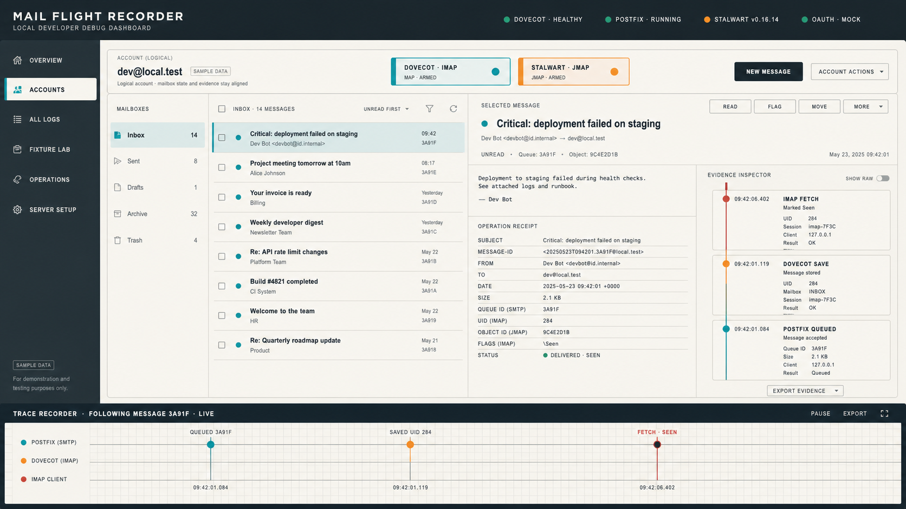
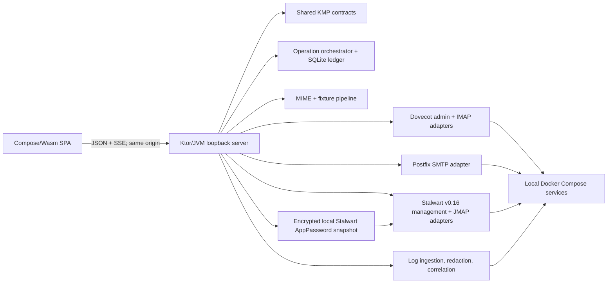

# Debug Dashboard — Design Specification

**Date:** 2026-07-23

**Status:** Design approved; AppPassword and confirmed Dovecot stdio amendments incorporated

**Amended:** 2026-07-27 — direct per-account Stalwart AppPasswords and a trusted test-sandbox threat model

**Target:** `debug-dashboard/`

## 1. Goal

Build a local web application that lets a trusted developer team administer, exercise, and diagnose the repository's Dovecot and Stalwart test mail stores without switching among shell scripts, protocol clients, and container logs.

The first usable release must support all nine requested workflows against both supported provider profiles:

1. inspect server logs;
2. inspect account-related logs;
3. create accounts and select a supported provider/protocol profile;
4. author, import, generate, append, and deliver messages;
5. list, create, and delete folders;
6. list and read messages;
7. change account passwords;
8. delete accounts;
9. mark read/unread, flag/unflag, move, copy, trash, and permanently delete messages.

A disabled baseline action does not count as support. The release remains not ready until the live two-provider acceptance suite passes.

## 2. Product Boundaries

### In scope

- One loopback-only dashboard for the repository's local Docker Compose sandbox.
- Dovecot with IMAP and Postfix SMTP/LMTP.
- Stalwart v0.16.14 with JMAP mail, submission, and JMAP-based management.
- One logical email address with independent Dovecot and Stalwart provider instances.
- Direct mailbox append and real protocol-level delivery as distinct modes.
- Deterministic fixtures, authored text, uploaded EML, random scenarios, and generated threads.
- Live and historical diagnostics with explicit correlation confidence.
- Provider-native identifiers, results, errors, and concurrency semantics.

### Out of scope

- Remote, production, or multi-user administration.
- Protection from a malicious teammate, a process already running as the repository owner, or anyone with Docker/repository access.
- Production secret management, compliance controls, external identity governance, or public deployment hardening.
- Implicit synchronization between Dovecot and Stalwart stores.
- Arbitrary Docker, shell, filesystem, or server-management access.
- Enabling arbitrary provider/protocol combinations in the first release.
- POP3, Exchange, or other additional protocol profiles in the first release.
- A general-purpose end-user mail client.
- Stalwart v0.15 dashboard compatibility.
- Making Open Mail Orbit part of the critical path.
- A Gradle, React, TypeScript, npm, or hidden fallback build.

## 3. Approved Decisions

| Area | Decision |
|---|---|
| Operating model | Host-native local application on the same machine as Docker Compose |
| Frontend | Compose Multiplatform/Wasm SPA |
| Backend | Ktor/JVM loopback service |
| Shared code | KMP contracts targeting JVM and `wasmJs` |
| Build | Kotlin Toolchain wrapper and YAML module model only |
| Supported profiles | `dovecot-imap` and `stalwart-jmap` |
| Stalwart baseline | Pin v0.16.14 and migrate before dashboard implementation |
| Stalwart mail access | One dashboard-owned, mail-only AppPassword per ordinary Account; no global impersonation |
| Stalwart enrollment | Use the Account's normal password only for the active create, enroll, repair, or explicit rotate request |
| Local secret store | Small JDK-only AES-256-GCM snapshot under `.runtime`; repository-owner access is trusted |
| Security posture | Pragmatic loopback safety for a trusted test sandbox, not production hardening |
| Logical accounts | Same address, separate provider instances and provider state |
| Message creation | Direct append and true delivery, visibly distinguished |
| Operation model | Durable jobs with provider/item outcomes and reconciliation |
| Visual world | Flight-recorder workbench |
| Defining composition | Evidence Split |

## 4. Direction Contract

**THESIS:** Mail state and the evidence that produced it belong on one instrument panel. The surface refuses both the generic rounded-card admin dashboard and the terminal-shaped neon developer console.

**OWN-WORLD:** Recorder-paper work zones sit inside a graphite powder-coated shell. Dovecot cyan and Stalwart amber mark registered provider channels; a rare red cursor marks destructive risk, failure, or the selected trace position. Keylines, compact labels, tabular notation, and low-radius controls replace floating cards.

**STORY:** Select a logical account, choose a provider channel, perform a mail or account action, inspect its provider-native receipt, and follow the correlated evidence without leaving the workspace.

**FIRST VIEWPORT:** Health spans the top, navigation stays compact at left, mailbox work occupies roughly 62%, and message detail, receipt, and evidence inspector occupy roughly 38%. The recorder strip spans the lower edge.

**FORM:** Grounded direction 4, composition option 2, registration-console staging, seed `a26b17b8`.

The approved north-star comp is included below. It establishes hierarchy, density, and material—not literal dates, IDs, copy, dimensions, or component implementation.



Durable visual rules live in `DESIGN.md`; route-specific strategy lives in `.impeccable/surfaces/debug-dashboard.md`.

## 5. Architecture



The browser never talks directly to a mail server, management endpoint, Docker socket, or host file. All privileged access stays in the Ktor process.

### 5.1 Kotlin Toolchain project

The project is created inside `debug-dashboard/` using the Kotlin Toolchain initializer and checked-in wrapper. Its intended module boundaries are:

```text
debug-dashboard/
├── kotlin
├── project.yaml
├── dashboard-contract/   # kmp/lib: JVM + wasmJs
│   └── module.yaml
├── dashboard-server/     # jvm/app: Ktor, adapters, jobs
│   └── module.yaml
└── dashboard-web/        # wasm-js/app: Compose SPA
    └── module.yaml
```

Exact generated directories may follow the toolchain's current template, but these three ownership boundaries remain.

No Gradle files are added. The checked-in `./kotlin` wrapper is the supported build entry. No task silently invokes Gradle, npm, a generated Node project, React, or TypeScript.

### 5.2 Runtime placement

The Ktor service runs on the host and binds only to `127.0.0.1`. Host placement is required because it:

- serves the compiled Wasm assets and versioned JSON API;
- invokes a fixed allowlist of `docker compose` and `doveadm` operations;
- reads Docker Compose stdout without mounting the Docker socket into another container;
- atomically updates the gitignored Dovecot runtime eligibility file;
- connects to the exposed IMAP, SMTP, and JMAP endpoints;
- maintains a local, gitignored operation database and short-lived upload spool;
- keeps dashboard-owned Stalwart AppPasswords in a small encrypted snapshot outside SQLite.

All host-published sandbox ports used by the dashboard are bound to loopback during the provider-baseline gates; the current unqualified Compose bindings are not an acceptable local-only boundary.

The service discovers the repository root from validated configuration. Requests cannot supply arbitrary command names, service names, working directories, or filesystem paths.

### 5.3 Module responsibilities

| Unit | Responsibility | Depends on |
|---|---|---|
| `dashboard-contract` | DTOs, provider keys, capabilities, operation states, errors, validation, route constants | Kotlin serialization only |
| `dashboard-web` | Navigation, account workspace, forms, message reader, logs, Trace lens, accessibility | `dashboard-contract`, Ktor client, Compose |
| HTTP/API layer | Same-origin API, CSRF/session checks, SSE, content headers, request validation | application services |
| Account registry | Live projection of provider accounts into logical addresses | account admin adapters |
| Operation orchestrator | Locks, idempotency, progress, cancellation, partial outcomes, reconciliation | ledger and provider adapters |
| Dovecot admin adapter | Eligibility-file parsing and atomic mutation, password hashing, auth-cache flush, session kick, auth-path verification | gitignored runtime filesystem and allowlisted `doveadm` |
| Dovecot mail adapter | IMAP folder/message reads and mutations with UID semantics | IMAP endpoint |
| Postfix submission adapter | Real SMTP envelope submission and queue receipt capture | SMTP endpoint |
| Stalwart admin adapter | Domain/account query, create, credential update, destroy | v0.16 JMAP management |
| Stalwart credential lifecycle | Enroll, load, rotate, revoke, and repair the exact Account's dashboard AppPassword | request-scoped normal password, management revocation, encrypted snapshot |
| Stalwart mail adapter | Mailbox, Email, Identity, blob, import, and submission operations | discovered JMAP Session and exact Account credential lease |
| Message factory | Text-to-MIME, EML validation, fixtures, deterministic random data, threads | bounded host inputs |
| Log pipeline | Docker log tail/history, optional `x:Log`, parsing, redaction, correlation | allowlisted log sources |

Each adapter returns typed provider results. It does not throw raw protocol output across the application boundary.

## 6. Provider and Account Model

### 6.1 Logical accounts

A logical account is keyed by a canonical full email address. It contains zero or one instance of each supported provider profile:

- `dovecot-imap`;
- `stalwart-jmap`.

The first release accepts a bare addr-spec only—no display name, comment, or quoted local part—for a discovered sandbox domain. The domain is normalized to lowercase ASCII. The local part must already be lowercase, is preserved byte-for-byte after validation, and must match the provider-returned canonical address. The dashboard does not guess that differently cased local parts identify the same account.

The registry is a projection of live provider state, not a second authoritative account database. On startup and explicit refresh, the server:

1. lists eligible Dovecot users;
2. queries eligible Stalwart `Account/User` objects;
3. joins them by canonical address;
4. overlays dashboard operation/reconciliation metadata and safe Stalwart mail-access readiness.

Protected administration or service identities are marked as protected and cannot be edited or deleted through ordinary account workflows.

The encrypted credential snapshot is not account authority. An Account record may mark a live Stalwart provider instance as `ready`, `enrollmentRequired`, `recoveryRequired`, temporarily `rotating`, or `removalPending`; store-level validation may supersede every Account with global `storeUnavailable`. Records are keyed by immutable Stalwart Account ID, never attached by email address alone, and are never created for protected identities.

### 6.2 Capability profiles

The account form presents named profiles, not two unrestricted dropdowns:

| Profile | Access | Administration | Delivery |
|---|---|---|---|
| Dovecot · IMAP | IMAP | passwd-file + `doveadm` | Postfix SMTP |
| Stalwart · JMAP | JMAP mail | v0.16 JMAP management | JMAP `EmailSubmission` |

The UI renders only capabilities returned by the readiness probe. However, every baseline capability in Section 14 is mandatory for a provider to be marked usable.

Additional protocol enablement belongs to a later Server Setup phase. The first release may display discovery information but must not pretend, for example, that the current Stalwart profile exposes IMAP.

### 6.3 Provider-native keys

Provider identity remains explicit:

- IMAP message: account, mailbox, UIDVALIDITY, UID.
- JMAP message: accountId, Email id, and latest Email state.
- IMAP mailbox: account plus encoded mailbox name and delimiter context.
- JMAP mailbox: accountId, Mailbox id, latest Mailbox state, role, and rights.

The shared contract may wrap these in sealed provider-specific types. It must not flatten them to a generic string that loses concurrency meaning.

## 7. Authentication and Credential Strategy

### Browser session

The first release serves the dashboard over loopback HTTP. On each Ktor start, the server generates a 256-bit, single-use bootstrap secret that expires after 60 seconds and prints a URL whose secret is in the fragment. The fragment is not sent in the HTTP request or referrer. The SPA exchanges it once through an exact-origin bootstrap request, immediately removes it with `history.replaceState`, and receives:

- a host-only, `HttpOnly`, `SameSite=Strict` session cookie scoped to `/`;
- a session-bound CSRF value returned in the response body and held only in memory.

After a full-page reload, the fragment is intentionally gone but the process-local session cookie may still be valid. In that case the SPA POSTs to a dedicated session-maintenance endpoint to reacquire the current session-bound CSRF value. The value is derived from the opaque session through a process-local secret, so the server need not persist or expose plaintext CSRF material and concurrent tabs receive the same current value. The endpoint requires the valid cookie plus the same exact Host, Origin, and Fetch Metadata checks as bootstrap, accepts no query credentials, performs no provider mutation, and returns a no-store response. It is the only authenticated POST that does not require the CSRF header. Failure requires a new locally printed bootstrap URL.

The session rotates at bootstrap, ends with the server process, and has an eight-hour absolute maximum. Expiry requires a new locally printed bootstrap URL. No API, SSE stream, or mutation accepts a session or bearer value in its query string.

The session protects the privileged loopback API from unrelated browser origins, DNS rebinding, and LAN callers. A process already running as the same operating-system user is outside this boundary because it can read the repository configuration and control the same Docker sandbox.

The browser never receives mail-server administration credentials, operator credentials, recovery secrets, or Docker access.

### Provider administration

- Dovecot administration uses the gitignored runtime eligibility file and allowlisted `doveadm`.
- Stalwart administration uses a protected, server-side v0.16 management Account with an API-key credential in permission `Replace` mode. Its allowlist contains `authenticate`, Account get/query/create/update/destroy, Domain get/query/create, Task get/query, and optional Log get/query. It has neither `impersonate` nor mail read/mutation/submission permissions.

### Mail access

Normal browsing and mutation must not require the dashboard to persist every user's password.

- Dovecot uses a dedicated master/operator identity whose IMAPS listener binds
  only to container loopback and has no host publication. The host-native
  backend reaches it solely through the fixed, non-shell, TLS-verifying
  Docker-exec/stdio transport on an internal bridge whose only service member
  is the operator. The full transport, lifecycle, and proof amendment is
  [2026-07-30-dovecot-operator-stdio-transport-design.md](./2026-07-30-dovecot-operator-stdio-transport-design.md).
- Stalwart authenticates directly as the selected ordinary Account with one dashboard-owned AppPassword stored by the Ktor process. There is no Stalwart mail-operator Account and no `impersonate` grant or `target%operator` authentication path.

The Dovecot operator approach is a Gate 0C contract test. If the current image cannot isolate the master identity without weakening ordinary account authentication, implementation stops for a credential-strategy decision.

Tagged v0.16.14 makes this split necessary: AppPasswords are server-generated, returned only when created, scoped to the Account that owns them, and explicitly rejected for impersonation. A non-impersonating management credential can revoke a known secondary credential through an Account update but cannot create an AppPassword for another Account.

The dashboard therefore creates an AppPassword only while authenticated as the exact ordinary Account:

- new Stalwart accounts reuse the normal password already present for the active create request;
- an existing or migrated Account asks for its current normal password once to enable dashboard mail access;
- repair and explicit rotation ask for the current normal password again, or may use the new request-scoped value during an explicit normal-password reset;
- the normal password is released after the operation and is never written to the credential store or operation ledger.

Each dashboard AppPassword uses permission `Replace` with only the exact Gate-0B-proven JMAP authentication, mailbox, Email, blob, Identity, and submission permissions needed by the requested workflows. It has no impersonation, Account/Domain/Task/Log management, normal-password management, API-key management, or AppPassword-management permission. A leaked mail credential therefore cannot mint a replacement credential.

Normal password reset preserves and re-probes the dashboard AppPassword unless the user explicitly requests rotation. The dashboard never falls back to global impersonation or silently resets a normal password.

### Stalwart mail-access lifecycle

The reserved remote description prefix `mail-sandbox/debug-dashboard/` belongs exclusively to this application on the test server. Each created credential adds the local store UUID and generation. The management adapter may enumerate and revoke credentials with that prefix, but it preserves the normal Password, user-created AppPasswords, API keys, and all unrelated fields.

The user-visible mail-access state for each ordinary Account is:

| State | Meaning and available action |
|---|---|
| `enrollmentRequired` | The live Account has no local record and no remote credential with the reserved prefix. Mail actions are disabled; **Enable dashboard mail access** asks for the normal password once. Explicit successful removal also returns here. |
| `ready` | Exactly one active local generation matches the remote credential ID and direct authentication succeeds. Mail actions are enabled. |
| `rotating` | An explicitly requested rotation has a durably captured successor or is retiring the old generation. New mail actions wait until reconciliation completes. |
| `recoveryRequired` | Local and remote inventory disagree, a credential is revoked, a create response was lost, a reserved remote credential has no captured secret, or an account-level record is invalid. **Repair** asks for the normal password, removes all reserved credentials for that Account, verifies cleanup, and may then create exactly one replacement. |
| `removalPending` | Explicit Remove dashboard access or provider deletion has revoked or invalidated the remote credential but local cleanup is incomplete. Mail stays disabled and restart may finish local erasure. |

A first start with neither key nor ciphertext creates an empty store and marks existing ordinary Accounts `enrollmentRequired`. A missing key with existing ciphertext, a lone key, authentication-tag failure, or an unreadable snapshot produces the global `storeUnavailable` state, which supersedes every Account state until repaired; the dashboard does not overwrite either file. Server Setup offers an explicit **Reset dashboard credential store** operation that revokes every remote credential with the reserved prefix while preserving unrelated credentials, verifies the remote inventory is empty, quarantines the unusable local files, creates a fresh empty store, and leaves all ordinary Accounts `enrollmentRequired`. If remote cleanup cannot be proven, the reset stops and mail access remains disabled.

Enrollment and repair create no new credential until reserved-prefix inventory is known. During an explicit Repair request, cleanup of a previously known orphan may be followed by one replacement attempt using that request's normal password. If an AppPassword response or durable local capture from the current attempt is lost, the adapter uses the management credential to remove all reserved-prefix credentials for that exact Account, discards the request password, and does not create again in the same operation. A clean removal returns to `enrollmentRequired` with a `reconciliationRequired` operation receipt and retry requires password resupply; failed or ambiguous cleanup remains `recoveryRequired` and cannot consume another quota slot.

**Remove dashboard access** does not delete the Account and does not require its normal password. It takes the Account's exclusive mail-credential lock, drains active mail operations, revokes all reserved-prefix credentials through the management adapter, verifies none remain, then erases the local record and returns to `enrollmentRequired`. Remote success followed by local-erasure failure becomes `removalPending`; local material is never erased first.

Credential-list updates accept a trusted test-sandbox no-concurrent-writer contract: while enrollment, repair, rotation, removal, password reset, or Account deletion owns the Account lock, teammates do not edit that Account's credentials in the Stalwart UI or another tool. v0.16.14 does not provide an `ifInState` guard for this Account credential patch. The adapter therefore re-fetches immediately before mutation, removes only credential IDs carrying the reserved prefix, submits once, then re-fetches and verifies that all unrelated credential IDs and values were preserved. An observed mismatch leaves the Account in `recoveryRequired` and the operation in `reconciliationRequired`; the design does not add a distributed lock for external tools.

Manual rotation acquires the same exclusive lock and blocks new mail operations. It waits up to 30 seconds for existing per-Account credential leases to close before creating anything; timeout leaves the active credential unchanged. After the drain, it authenticates with the request-scoped normal password, creates and durably captures one successor, probes it, records `rotating`, switches the active generation, records the old generation as retiring, revokes the old credential, verifies old failure/new success, and removes old local bytes. Quota exhaustion stops before changing the active credential.

On restart, `rotating` reconciliation probes both recorded generations. A valid staged successor is promoted and the old credential is retired; an invalid staged successor is revoked and the valid old generation is restored. A retiring old generation is revoked before the new generation returns to `ready`. If neither generation is valid, a reserved credential is missing from local state, or Stalwart is unavailable, the adapter creates nothing and reports recovery/reconciliation instead of guessing. Process restart ends all old leases, so no cross-process drain is required.

### Server-side secret material

The Dovecot operator and Stalwart management secrets are generated during local setup and enter the Ktor process only through environment/Compose secret injection or an owner-readable gitignored runtime file. They never use repository defaults and are not stored in source, SQLite, browser payloads, operation receipts, or logs. Their protected provider IDs are excluded from ordinary account CRUD.

Dashboard-owned Stalwart AppPasswords live in:

- ciphertext snapshot: `debug-dashboard/.runtime/stalwart/app-passwords.v1.enc`;
- 256-bit AES key: `debug-dashboard/.runtime/keys/stalwart-app-passwords.v1.key`.

The implementation uses only JDK cryptography: AES-256-GCM with a fresh nonce for every snapshot rewrite and format/store identity as associated data. Directories are owner-only and files are mode `0600` on supported POSIX filesystems. The fixed paths reject symlinks and non-regular files. Snapshot writes use a file lock, restrictive same-directory temporary file, fsync, and atomic replace.

This encryption is an accidental-disclosure guard for a trusted test sandbox, not a defense against another process running as the repository owner. The key and ciphertext are gitignored, excluded from SQLite, diagnostic exports, default Stalwart backups, and Clear Local History. There is no Keychain, KMS, shared-team vault, automatic expiry, or unattended rotation in the first release.

The snapshot is keyed by immutable Account ID and records a store UUID, revision, provider credential ID, reserved dashboard description/generation, lifecycle phase, and mutable secret bytes. It holds one active value and, only during rotation, one staged value. If the key or snapshot is lost or unreadable, the dashboard does not invent a replacement key over existing data; it enters global `storeUnavailable` until the explicit reset workflow proves remote cleanup and creates a new empty store. If Stalwart is unavailable or state is ambiguous, it mutates neither side and reports reconciliation.

Passwords supplied during account creation or reset are request-scoped:

- held only for the active operation and verification probes;
- never written to the dashboard database, log events, error details, browser history, or exports;
- overwritten or released when the operation finishes;
- still stored by the underlying provider according to its own supported credential mechanism.

## 8. API and Event Contract

All endpoints are under `/api/v1`. Resource reads are synchronous; mutations return an operation resource, even when they complete quickly.

| Route family | Purpose |
|---|---|
| `POST /session/bootstrap` | exchange the one-time fragment secret and establish the browser session |
| `GET /bootstrap` | authenticated dashboard version, readiness, capabilities, retention, and session metadata |
| `/accounts` | list, inspect, create logical/provider instances |
| `/accounts/{address}/providers/{profile}` | provider detail, credential reset, delete |
| `/accounts/{address}/providers/stalwart-jmap/mail-access` | safe enrollment status plus enroll, rotate, repair, or revoke actions |
| `/mailboxes` | list, create, update, delete |
| `/messages` | query, structured read, raw download |
| `/message-actions` | read/unread, flag/unflag, move, copy, trash, permanent delete |
| `/message-lab` | preview, append, deliver, deterministic generation |
| `/operations` | status, item/provider results, cancellation, retry, reconciliation |
| `/logs` | bounded query across normalized and raw-safe evidence |
| `/server-setup` | provider capability status plus explicit Stalwart credential-store reset/recovery |
| `GET /events` | reconnectable SSE stream for health, jobs, mail refresh, and log events |

Mutation requests include an idempotency key. The server validates it against the operation kind and normalized target; reusing it for a different mutation is rejected.

Errors use a typed problem shape:

- stable dashboard code;
- safe user-facing summary;
- field errors when applicable;
- provider profile and safe native code;
- retryable flag;
- operation and correlation identifiers;
- suggested remediation;
- no unredacted native payload.

SSE events have monotonic local IDs. A reconnect with `Last-Event-ID` resumes from the bounded event buffer when possible and emits an explicit resync event when the gap is no longer retained.

## 9. Operation Model

Every mutation follows:

1. validate normalized intent;
2. probe required capabilities and current state;
3. acquire a per-logical-account mutation lock;
4. create or resume an idempotent operation;
5. execute provider steps;
6. store itemized safe receipts;
7. refresh affected resources;
8. release the lock and publish the terminal event.

Operation states are:

- `accepted`;
- `preflight`;
- `running`;
- `succeeded`;
- `failed`;
- `cancelled`;
- `reconciliationRequired`.

Multi-provider work is a saga, not a distributed transaction. A provider that succeeds is never reported as failed merely because the other provider failed. The dashboard does not hide partial completion with an automatic destructive rollback. It records exact outcomes and offers scoped retry or inspection.

Provider receipts separate the requested logical postcondition from ancillary verification. For Stalwart account deletion, absence of the pre-mutation Account ID plus failure of ordinary address/account resolution is the required logical postcondition; a negative AppPassword authentication probe is ancillary evidence only when readable local credential material existed. Background data cleanup has its own Pending, Retry, Failed, confirmed-complete, or unverified receipt. An observed Failed cleanup makes the operation `reconciliationRequired`. A task that completed before observation may leave the logical deletion `succeeded` with an explicit unverified-cleanup warning; it is never reported as confirmed purge.

Retry is offered only when its inputs still exist. After a request-scoped password or completed upload has been discarded, the UI asks the user to supply the secret or message source again and creates a linked retry operation; it never implies the ledger can replay secret material it did not retain.

Ordinary Stalwart mail operations acquire a lease on the active AppPassword generation from the encrypted snapshot. Enrollment, rotation, repair, removal, normal-password reset, and Account deletion take the exclusive credential lock and block new leases. They wait at most 30 seconds for existing leases to close; timeout makes no provider or local-credential change and returns a retryable operation failure. A missing, unreadable, revoked, or mismatched credential does not trigger password fallback; it produces the typed mail-access state from Section 7.

Enrollment, repair, and rotation cannot be replayed after their request-scoped normal password has been discarded. Their safe Account ID, provider credential ID, generation, and lifecycle outcome may be recorded, but neither the normal password nor AppPassword value enters the ledger.

Cancellation is cooperative between provider calls. It cannot interrupt an atomic remote method halfway through. An operation still marked running after a server restart transitions to `reconciliationRequired` with a server-interruption reason before it may be retried.

### Local persistence

A gitignored SQLite database stores:

- operation metadata with secrets removed;
- provider/item outcomes and safe native receipts;
- correlation identifiers;
- reconciliation links;
- bounded redacted event history.

SQLite never stores the AppPassword snapshot, its key, or raw provider credentials. Clear Local History affects only SQLite and the redacted event cache; removing dashboard mail access is a separate explicit provider operation.

Default bounds:

- operation records: 30 days or 10,000 rows, whichever is reached first;
- correlated event cache: 24 hours or 50,000 events;
- uploads and generated raw messages: delete after the job, with a one-hour crash-recovery maximum.

The UI exposes retention status and a deliberate Clear Local History action.

## 10. Core Workflows

### 10.1 Account lifecycle

#### Create

1. Validate canonical address, selected profiles, password policy, domain, and duplicates.
2. Preflight all selected providers before mutating either.
3. Create each provider instance under the account lock.
4. Provision any provider-specific dashboard mail credential while the request-scoped password is available.
5. Verify login and baseline capabilities.
6. Refresh the logical registry and publish provider-specific results.

Dovecot creation:

- use `debug-dashboard/.runtime/dovecot/users` as the mutable eligibility and passwd-file authority; tracked `config/users` is migrated to non-secret seed input and is not mutated at runtime;
- parse and preserve the runtime file structure;
- reject delimiter, newline, duplicate, and path-injection input;
- generate a supported salted Dovecot password hash through an allowlisted provider command, never interpolate a raw password, and validate the scheme-prefixed result;
- hold one file-global lock from read through verification because all accounts share the file;
- fail closed unless the fixed parent and target resolve inside the repository runtime directory as regular, non-symlink paths;
- write a restrictive same-directory temporary file, fsync it, atomically replace the target, then fsync the parent directory where supported;
- preserve and verify the intended mode and ownership and clean abandoned temporary files;
- flush auth cache as needed and verify authentication.

Before Gate 1, existing scripts that create, update, restore, or read the account file must route through the same writer/snapshot boundary or be retired from mutation use. A per-account dashboard lock alone does not coordinate a shared file.

Stalwart creation:

- discover the management/JMAP endpoint rather than hardcoding `/api`;
- query or create the required `Domain`;
- create `x:Account` with `@type: User`, local-part `name`, `domainId`, User role, inherited permissions, and an internal Password credential;
- authenticate as that exact user with the request-scoped normal password, create the mail-only dashboard AppPassword, and capture its read-once value directly into the encrypted snapshot;
- verify the user's JMAP Session and required account capabilities through the AppPassword;
- ensure a usable submission Identity is available.

If the Account exists but AppPassword creation, local capture, or verification fails, the Account is not automatically destroyed. The provider result is truthful, mail access becomes `recoveryRequired`, and retry asks for the normal password again.

#### Change password

The user may reset one or both provider instances with the same new value. Outcomes remain separate.

- Dovecot atomically replaces the target password hash, flushes auth state, kicks active sessions, and verifies the new password. It verifies the old password fails only when that secret is supplied request-scoped or owned by the disposable acceptance test.
- Stalwart fetches the target Account, deliberately updates only the Password credential while preserving unrelated credentials, then verifies reauthentication with the new password. It verifies the old password fails only when that secret is supplied request-scoped or owned by the disposable acceptance test. The dashboard AppPassword remains a separate credential and is re-probed rather than silently rotated.

A password reset does not claim to revoke unrelated OAuth access or refresh tokens unless the provider proves that behavior.

The Stalwart form states that normal-password reset preserves dashboard mail access. A separate Rotate dashboard access action may reuse the new password during that same request; otherwise rotation remains a later explicit action.

#### Delete

Before deletion, the UI shows:

- selected provider instances;
- mailbox and message counts when the provider's mail credential is ready, otherwise **unknown — dashboard mail access unavailable**;
- whether provider data deletion is inherent or optional;
- active reconciliation warnings;
- a typed-address confirmation field.

For Stalwart, `x:Account/set` returning the ID in `destroyed` proves synchronous principal removal and scheduling of irreversible cleanup; it does not prove stored-data cleanup is complete. The adapter queries `x:Task` for `DestroyAccount`, then matches returned tasks by account ID/name/domain because Task query cannot filter directly by account:

- observed `Pending` or `Retry` keeps cleanup running and exposes due/attempt/failure detail;
- observed `Failed` produces `reconciliationRequired`;
- disappearance after the matching task was observed, plus failed Account lookup and authentication, confirms completion;
- if the task completes before it can be observed, logical account deletion may succeed but physical cleanup is labeled `unverified`, never “confirmed.”

Stalwart Account deletion requires neither enrollment nor readable counts. For a `ready` Account, the preview includes counts and the active dashboard generation; for an unenrolled or unhealthy Account, counts are explicitly unknown and deletion may continue after the same typed confirmation. The required logical proof is a management query returning no principal with the Account ID resolved before mutation plus ordinary address/account resolution rejecting that identity. A negative AppPassword probe is additional evidence only when a readable local credential existed.

After principal absence is proven, every secondary credential on that principal is invalid by construction and the adapter erases the Account-ID record from the encrypted snapshot. Provider deletion with failed local erasure becomes `removalPending`/`reconciliationRequired`, not a failed provider deletion. Recreating the same address with a new Account ID never reuses the old record.

Dovecot account deletion atomically removes the address from the canonical eligibility set, invalidates or rejects its mock OAuth tokens and refresh path, flushes auth state, and kicks sessions. Password login, OAuth login, master targeting, `doveadm` targeting, and LMTP user lookup must all reject the deleted address. Optional mailbox purge is a separate explicit choice performed through supported `doveadm` operations, never direct `vmail/` edits. If data is retained, the UI warns that recreating the same address may reattach the inert mailbox.

Deleting one provider retains the logical account if another instance remains.

### 10.2 Message Lab

The first-release delivery boundary is the registered local sandbox. Account creation and delivery targets are limited to domains discovered from the supported local provider configuration; the current default is `local.test`. The API and provider adapters accept envelope recipients only for live, non-protected registered provider instances, and the Postfix/Stalwart routing configuration rejects external or protected targets before queueing. Uploaded EML headers may name other addresses for fixture realism, but the preview shows the effective envelope separately and the dashboard does not offer external relay.

Sources:

- authored text with structured From/To/Cc/Bcc/Subject fields;
- uploaded EML;
- repository fixture selected only from `mails/`;
- deterministic random scenario with visible seed;
- deterministic multi-message thread.

The server parses and validates MIME, separates envelope recipients from headers, enforces a 25 MiB default upload limit, and provides a raw preview before execution.

Two modes are always separate:

| Provider | Direct append | Real delivery |
|---|---|---|
| Dovecot | allowlisted `doveadm save` to a chosen mailbox | Postfix SMTP envelope submission |
| Stalwart | upload RFC 5322 blob, then `Email/import` | create/import Email, select Identity, then `EmailSubmission/set` |

Receipts identify the actual path and include available Message-ID, queue ID, mailbox/object ID, state, timing, and linked evidence.

Delivery has two separately visible outcomes: provider acceptance and arrival in the selected registered target mailbox. Acceptance fixtures use a unique Message-ID and operation marker. For Dovecot, the adapter follows the Postfix queue ID through LMTP evidence and then fetches the marker from the recipient mailbox. For Stalwart, the sender's AppPassword drives import/submission and each recipient's own dashboard AppPassword drives arrival read-back.

Before any Stalwart upload or submission, the operation preflights that the selected sender and every selected Stalwart recipient are `ready`. If any are not ready, it returns a typed per-account readiness error and makes zero submission calls. Remediation is state-specific: `enrollmentRequired` links to Enable, `recoveryRequired` links to Repair, `rotating` shows wait/progress, `removalPending` links to reconciliation/cleanup detail, and `storeUnavailable` links to the Server Setup credential-store reset. Newly created Accounts satisfy this automatically; migrated Accounts must be enrolled before they participate in a dashboard-verified delivery.

Multi-recipient terminal state is deterministic:

- `failed` when the provider conclusively rejected every recipient and none was accepted;
- `succeeded` only when every recipient was accepted and the marker was relisted/read from every target mailbox;
- `reconciliationRequired` when at least one recipient was accepted but any recipient later fails permanently, times out, or remains unverified, or when acceptance itself is ambiguous. Confirmed arrivals and acceptance receipts remain itemized.

JMAP submission success means accepted for submission, not confirmed delivery. Later `deliveryStatus` is shown when available. A successful all-recipient delivery with failed Sent-folder filing is `reconciliationRequired` with the delivery sub-result preserved as successful; it is not mislabeled as a failed send. A filing success does not prove target arrival.

### 10.3 Folder lifecycle

Dovecot:

- list via IMAP with delimiter, subscription, special-use, and hierarchy information;
- create with validated encoded name;
- delete only after child and message-count preview;
- preserve server semantics instead of assuming localized names identify Inbox, Trash, or Sent.

Stalwart:

- list with `Mailbox/get`;
- authenticate every call with the selected Account's active AppPassword generation;
- use `role` for system mailbox meaning and preserve `myRights`;
- create/update/delete with `Mailbox/set` and `ifInState`;
- default deletion uses `onDestroyRemoveEmails: false`;
- destructive removal of orphaned Email objects requires separate confirmation.

### 10.4 Message list and read

Dovecot queries use UID-based paging and retain UIDVALIDITY. Stalwart uses the selected Account's active AppPassword, chains `Email/query` to `Email/get`, and keeps query state distinct from Email state. Missing or unhealthy dashboard mail access returns the typed enrollment/recovery state before any mail method call.

The reader supports:

- structured headers and address fields;
- plain-text and sanitized HTML alternatives;
- bounded body loading;
- attachment metadata and same-origin download;
- raw RFC 5322 download;
- provider IDs and safe diagnostic metadata.

HTML is sanitized server-side with a maintained allowlist library and rendered in an isolated sandboxed surface. Remote content is blocked by default. Raw messages download with attachment disposition and `nosniff`; they are not injected into the application DOM.

### 10.5 Basic message operations

Baseline single and batch operations:

- mark read/unread;
- flag/unflag;
- move;
- copy;
- move to Trash;
- remove from the current folder where the provider supports membership;
- permanently delete.

Dovecot uses UID commands with UIDVALIDITY. MOVE is required for the baseline profile; broad EXPUNGE is never used as an unsafe fallback.

Stalwart uses the selected Account's active AppPassword for `Email/set` keyword and mailbox-membership patches with `ifInState`. Same-account copy adds destination membership when `maxMailboxesPerEmail` allows it. Cross-account `Email/copy` remains explicitly non-atomic when followed by source deletion.

Batch results remain itemized. On stale state or UIDVALIDITY change, the affected resource refreshes, successful items remain applied, and failed selections remain selected for deliberate retry.

## 11. Logs and Correlation

### Sources

- Docker Compose stdout/history for the fixed service allowlist: Dovecot, Postfix, Stalwart, and OAuth mock.
- Stalwart `x:Log/query` and `x:Log/get` when `urn:stalwart:jmap` and permissions are present.

Community-edition structured Log access is optional enrichment; Docker stdout remains the baseline. Enterprise-only trace history, metric history, or live telemetry is not required.

The dashboard never calls `x:Log/set`.

Stalwart mail activity is direct ordinary-account authentication, not an operator-target chain. Log redaction recognizes the v0.16 AppPassword form, Basic authorization values, normal passwords, management API keys, and secret-store errors before parsing or correlation. Account-scoped logs still work for unenrolled Accounts when server events identify them; enrollment controls only dashboard mail access.

### Normalized event

Each safe event carries:

- timestamp and ingestion cursor;
- service and source;
- level and event kind when derivable;
- account role/address when present;
- operation, Message-ID, queue, session, UID, mailbox, and provider object identifiers when present;
- redacted raw line reference;
- parser version and correlation confidence.

### Confidence

Trace links are labeled:

- **Exact:** the same stable identifier appears in both records.
- **Linked:** a deterministic chain such as operation → Message-ID → queue/session connects them.
- **Time-adjacent:** account and bounded time window suggest a relationship but do not prove it.
- **Unmatched:** displayed only in All Logs.

An account-scoped log view includes an event in its primary results only when the parser found that account explicitly or a deterministic identifier chain links the event to an operation owned by that account. Stable identifiers are namespaced by provider and source; a Message-ID by itself is not unique enough to establish Exact confidence. Multi-recipient events may belong to more than one account and retain the relationship role for each.

Time-adjacent events appear, when requested, in a separate Nearby evidence group and never become account membership or Exact/Linked confidence. An unparseable event stays unmatched rather than inheriting the current account from its timestamp.

Correlation contract tests interleave two accounts and cover duplicate and missing Message-IDs, queue/session reuse, multi-recipient delivery, malformed parser input, and redaction failure paths. They assert both the expected inclusion set and the deterministic exclusion set for each selected account.

Stalwart's documented structured Log filter is text-only. Level, event, and time filtering may be applied to fetched normalized pages, but server-side filter claims require a v0.16.14 probe.

## 12. User Interface

### 12.1 Information architecture

Primary destinations:

- **Overview:** service health, readiness gates, recent operations, reconciliation.
- **Accounts:** logical account registry and the defining Evidence Split workspace.
- **All Logs:** cross-service history/live tail, source/confidence filters, pause, export.
- **Fixture Lab:** repository EML, authored/generated scenarios, seed replay.
- **Operations:** progress, cancellation, retry, provider/item results, reconciliation.
- **Server Setup:** discovered versions, endpoints, profiles, permissions, aggregate local credential-store readiness/reset, and later protocol configuration.

### 12.2 Account registry

The registry supports search, profile/status filters, provider capability markers, protected identities, Stalwart mail-access readiness, and account create/delete entry points.

Account creation uses a progressive side sheet:

1. address and password;
2. one or both named provider profiles;
3. provider-specific preflight;
4. review and create.

Unsupported combinations are absent, not merely selectable with a warning.

New Stalwart Accounts show dashboard-mail provisioning as part of create. Existing Accounts may show **Enable dashboard mail access**, which asks for the normal password for that request only. Ready Accounts expose explicit Rotate and Remove dashboard access actions; unhealthy Accounts expose Repair. The browser never receives or displays the AppPassword value. Protected identities expose none of these actions.

### 12.3 Evidence Split workspace

The wide composition contains:

1. graphite application shell and top health rail;
2. compact left navigation;
3. logical account header with Dovecot and Stalwart channel plates;
4. mailbox and message work area on the left;
5. selected message, provider-native receipt, and vertical evidence inspector on the right;
6. contextual recorder strip across the lower edge.

Only one provider's mailbox state is active at a time; channel plates behave as accessible tabs and retain their independent readiness state. A Stalwart plate in `enrollmentRequired` or `recoveryRequired` keeps account administration and evidence reachable while replacing mail actions with the corresponding enrollment or repair action.

Moving the selected trace cursor updates the evidence inspector and highlights the related message or operation. Selection is conveyed through text, geometry, and focus—not color alone.

### 12.4 Visual rules

- Recorder Paper and Panel Fog own large working regions.
- Graphite owns shell, rails, and primary actions.
- Cyan and amber mark provider ownership only.
- Red is rare and reserved for the selected trace cursor, failure, or destructive action.
- Monospace is reserved for machine values.
- Panels are flat and keylined; ordinary content is not placed in floating cards.
- No fake knobs, gauges, aviation terminology, neon glow, glass, or decorative waveform animation.

### 12.5 Responsive behavior

Responsive change is structural:

- **Wide:** full Evidence Split, folders, message list, reader/receipt/inspector, and trace all visible.
- **Medium:** folders collapse to a drawer; message list and reader/inspector remain side by side; trace remains docked and resizable.
- **Narrow:** navigation becomes a compact top/bottom destination control; account/provider summary persists; message list, reader, evidence, and trace become an ordered drill-in sequence with clear Back behavior.

The trace is never removed on small screens; it becomes a reachable full-width stage with preserved cursor context.

### 12.6 Accessibility

- All workflows are keyboard-complete.
- Provider tabs, tables/lists, dialogs, menus, and progress use semantic roles available in Compose/Wasm.
- Every control has visible focus.
- Color is never the only state cue.
- Service and operation updates use non-disruptive live regions.
- Motion stays within the Operate-mode 150–250 ms range and conveys state only.
- `prefers-reduced-motion` removes cursor travel and paper-feed transitions while preserving the final linked state.
- HTML message content cannot capture application focus or navigate the top-level page.

## 13. Security and Safety

This is a local test-email provider for trusted developers reproducing client/provider issues. A teammate or process with the same operating-system identity, repository access, Docker control, or access to `.runtime` is trusted and outside the threat model. The design keeps enough isolation to avoid accidental data loss, accidental secret disclosure, browser-origin mistakes, and cross-account test contamination; it does not add production IAM, KMS, hostile-user isolation, security audit trails, or public-service hardening.

### Local HTTP boundary

- Bind to loopback only.
- Use one startup-selected canonical origin and allowlist its exact Host; reject DNS-rebinding aliases.
- Require the exact Origin on bootstrap, CSRF reacquisition, and all mutations, and reject incompatible Fetch Metadata such as cross-site requests.
- Disable CORS.
- Use the one-time startup handshake and `HttpOnly`, host-only, `SameSite=Strict` session described in Section 7.
- Require the session-bound CSRF value in a custom header for every provider/application mutation; the no-store session-maintenance reacquisition POST is the sole exception and cannot reach providers or the operation ledger.
- Set a restrictive Content Security Policy including `frame-ancestors 'none'`.
- The initial loopback-HTTP cookie is intentionally not marked `Secure`; if dashboard HTTPS is added later, it becomes mandatory. Dashboard transport does not inherit security from Stalwart's separate TLS setting.

### Privilege boundary

- No Docker socket mount.
- No arbitrary subprocess, service, flag, path, or working-directory input.
- Build command arguments from typed allowlisted operations.
- Resolve and validate repository paths before use.
- Repository fixtures are selectable only under `mails/`.
- Temporary uploads use generated names in a dedicated gitignored directory.
- Never modify `vmail/` or `stalwart-data/` directly.
- Stalwart has no dashboard mail-operator principal or `impersonate` permission; each ordinary Account's AppPassword is server-bound to that Account.

### Content and secret boundary

- Redact normal passwords, Stalwart `app_` credentials, bearer tokens, Basic headers, cookies, recovery credentials, API keys, root-key material, and known secret fields before storage or broadcast.
- Apply redaction before parsing failures can emit raw payloads.
- Keep the AppPassword ciphertext and key at fixed gitignored owner-only paths outside SQLite and exports. Encryption protects accidental store-only copies; it is not claimed to resist the trusted repository owner.
- Sanitize HTML, block remote content, isolate rendering, and constrain downloads.
- Destructive account, mailbox, and permanent-message deletion require preview plus explicit confirmation.
- Stalwart account deletion and any orphan-removing mailbox deletion are labeled irreversible.

## 14. Release Gates and Acceptance

### Gate 0A — Kotlin Toolchain browser proof

Before feature implementation:

1. `./kotlin build` compiles a minimal Compose/Wasm application to `.wasm` and `.mjs`.
2. Authored HTML loads those assets without Gradle or generated Node tooling.
3. A Ktor/JVM app serves assets and SPA fallback from loopback.
4. History navigation, API calls, SSE reconnect, keyboard/focus semantics, and a production build are verified in a modern WasmGC browser.
5. If Kotlin Toolchain alone cannot support this, work stops for a design decision. There is no hidden fallback.

### Gate 0B — Stalwart v0.16.14 baseline

Before dashboard provider implementation:

1. Pin `stalwartlabs/stalwart` to v0.16.14 rather than `latest`.
2. Back up existing Stalwart state before migration; never edit RocksDB directly.
3. Replace legacy TOML/REST management assumptions with the v0.16 object model.
4. Retain the internal directory so password changes are real; layer OAuth/OIDC as an authentication flow rather than an external account directory.
5. Bind the Stalwart host port to loopback and record the source address Stalwart observes through Docker; IP-restrict credentials only if that local path is stable.
6. Establish an immutable protected management Account with an API key, permission `Replace`, only `authenticate`, Account get/query/create/update/destroy, Domain get/query/create, Task get/query, and optional Log get/query permissions, and no impersonation or mail permissions. The exact v0.16.14 permission names are captured by the contract probe rather than represented by a wildcard grant.
7. Prove an ordinary Account authenticated with its request-scoped normal password can create a server-generated AppPassword, the secret is returned only on creation and cannot be changed, and at least two credentials may coexist for bounded manual rotation.
8. Prove the management API key without `impersonate` cannot create or use another Account's AppPassword for mail, but can freshly fetch and revoke the exact dashboard credential through the trusted no-concurrent-writer Account update while preserving the normal password and every unrelated credential.
9. Give the dashboard AppPassword permission `Replace` with only the exact JMAP authentication/mail/blob/Identity/submission permissions required by the baseline. Prove it cannot impersonate, manage Accounts/Domains/Tasks/Logs, change normal passwords, or create/update/destroy AppPasswords.
10. Prove the JDK-only encrypted snapshot can capture the read-once secret, reload it after restart, reject a wrong key or malformed snapshot, distinguish enrollment from recovery, clean a lost-response orphan by reserved prefix, complete explicit removal, and reconcile every active/staged/retiring rotation phase without exposing values.
11. Discover and use the JMAP Session's `apiUrl`, `uploadUrl`, and `downloadUrl`.
12. Contract-test direct per-account Mailbox/Email mutations, raw import, Identity selection, import-to-submission chaining, local-only recipient routing and mailbox arrival, password reset with AppPassword preservation, structured Log access, manual AppPassword rotation/recovery, and old-credential rejection.
13. Run a negative matrix for wrong Account, protected Account, management Account, missing/revoked credential, and cross-account credential use. No fixture, Account, role, or API key may have `impersonate`.
14. Destroy a data-bearing disposable Account, prove its captured AppPassword fails, erase its local record, and observe matching `DestroyAccount` Pending/Retry/Failed/disappearance semantics plus the fast-completion `unverified` path without inventing a succeeded Task state.
15. If direct AppPassword mail access, targeted revocation, two-credential overlap, required Community-edition behavior, or safe re-enrollment cannot be demonstrated, stop for a design decision.

The existing v0.15 store may be migrated through Stalwart's supported process. Migrated ordinary Accounts begin `enrollmentRequired` because Stalwart cannot reproduce a read-once AppPassword value. A destructive fresh reset is a separate, explicit user choice and is not implied by this spec.

### Gate 0C — Dovecot operator access

Before dashboard provider implementation:

1. Pin the tested Dovecot image rather than `latest`.
2. Bind ordinary Dovecot and Postfix host ports to loopback and prove they are unreachable through a non-loopback interface.
3. Replace tracked, plaintext `config/users` as runtime authority with a gitignored, hashed eligibility/passwd file mounted through its containing directory; retain only non-secret seed input in Git. The canonical record is `<address>:<provider-hash>::::::`: eight passwd-file columns (`user`, `password`, `uid`, `gid`, `gecos`, `home`, `shell`, and `extra_fields`). The six post-password fields are empty because Dovecot configuration supplies the UID, GID, and home defaults; their delimiters are still required so passwd-file userdb recognizes the record.
4. Make that eligibility set authoritative for PLAIN/LOGIN, mock OAuth issuance/refresh/introspection, userdb existence, LMTP lookup, allowlisted `doveadm` targets, and master-user targets. Prefix-style test tokens do not bypass eligibility.
5. Route every account-file writer through one file-global lock and atomic writer, or retire the direct mutation path before Gate 1.
6. Configure a dedicated hashed master credential that is neither a normal passdb identity nor a mailbox/userdb account and is unavailable through POP3, SMTP SASL, OAuth, or ordinary self-login.
7. Establish an unpublished operator on a dedicated internal project bridge
   whose only service member is the operator. Its Dovecot 2.4 IMAPS listener
   sets `listen = 127.0.0.1` for port `31993`. Its bounded, quiet POSIX `sh`
   healthcheck requires a positive integer `process_count`, exact
   `throttle_secs: 0`, and exact `doveadm_stop: n` for both `auth` and
   `imap-login`, preserving every query and grep failure without relying on
   `pipefail`. It counts every state `0A` entry for port `7CF9` across
   `/proc/net/tcp` and `/proc/net/tcp6`, requires exactly one, and requires
   that entry to be exact IPv4 container loopback `0100007F:7CF9`. The
   host-native backend uses only the fixed, sanitized, non-shell
   `docker compose exec -T` OpenSSL stdio transport, including for readiness
   and every positive proof. TLS trusts the mounted certificate, verifies
   `localhost`, and permits only TLS 1.2/1.3. The fixed former host port
   `2993` remains a negative-probe target only. Exact allocation, deadline,
   close/reap, lease-capacity, process-inventory, and cleanup requirements are
   defined by
   [the reviewed stdio transport amendment](./2026-07-30-dovecot-operator-stdio-transport-design.md).
8. Require master authentication to continue into the canonical target-eligibility lookup without enabling direct ordinary-password authentication on the operator ingress. The exact chain is `operator-master` → `deny-direct` → `eligible-target` → `deny-missing`. Dovecot 2.4.1 `auth_preinit` silently omits a first non-master passdb with `skip = unauthenticated`, so `deny-direct` is the first non-master passdb and uses `skip = authenticated`. The canonical `result_success = continue` marks the master password verified, jumps to the first non-master passdb, and does not pre-authorize the target. A verified master continuation therefore skips `deny-direct`, while a direct bare-target LOGIN remains unauthenticated and stops there. `eligible-target` uses `skip = unauthenticated`, `result_failure = continue-fail`, and `result_internalfail = return-fail`. A found target's default `return-ok` finalizes success; a missing target clears any prior success and continues to `deny-missing`; an internal eligibility error fails immediately instead of being masked. Both deny passdbs set `deny = yes`, `nopassword = yes`, and `nodelay = yes`. The live proof first requires a timely tagged `NO` from bare-target SASL LOGIN with an eligible target's own generated password, then proves PLAIN rejection and combined master LOGIN success. This makes arbitrary, deleted, and protected targets fail while preserving the Dovecot 2.4 master-continuation semantics.
9. Prove the operator can list, read, append, and mutate mail for disposable eligible users through supported IMAP paths, and prove Postfix routes only to eligible sandbox recipients and mailbox arrival is observable, while the host-command surface remains the typed `doveadm` allowlist.
10. Delete a disposable identity and prove password login, OAuth login, refresh/introspection, operator targeting, `doveadm` targeting, and LMTP lookup fail while retained mailbox data stays inert.
11. Verify password reset and deletion do not require retaining the user's prior password.
12. If credential or ingress isolation cannot be demonstrated, stop for a design decision; do not silently store user passwords or expose the master credential on an ordinary network path.

### Gate 1 — Live parity suite

Against a fresh disposable Compose environment, every row must pass. “Both profiles” means that the same dashboard workflow is exercised once through `dovecot-imap` and once through `stalwart-jmap`; inspecting a disabled control or lower-level adapter test is insufficient.

| Workflow | Proof required on both profiles | Dovecot-specific evidence | Stalwart-specific evidence |
|---|---|---|---|
| Registry and profile selection | List logical accounts; create Dovecot-only, Stalwart-only, and dual-provider addresses; switch provider tabs without state leakage; deleting one instance retains the other | passwd-file projection and IMAP readiness match the Dovecot tab | `x:Account` projection plus `ready`/enrollment/recovery mail-access state match the Stalwart tab |
| Server logs | Query retained history, start live tail, pause/resume, reconnect, and see activity caused by the test | auth, IMAP, LMTP, and delivery events appear from allowlisted stdout | management, JMAP, and submission events appear from stdout; `x:Log` enriches only when enabled |
| Account-scoped logs | Generate interleaved activity for two accounts; the selected account includes its exact/linked events, excludes the other account's deterministic events, and labels merely time-adjacent evidence | queue/session/account chains retain their confidence | account/object/operation chains retain their confidence |
| Create account | Select the named profile, create the provider instance, provision dashboard mail access while the request password exists, verify login and mandatory capabilities, and show a browser-visible operation receipt | new IMAP login and capabilities succeed | internal Password, mail-only AppPassword capture, JMAP Session, Identity, and capabilities succeed without exposing either secret |
| Message source × path | For authored text, uploaded EML, and a deterministic random scenario, execute both Direct append and Deliver to a newly registered target; preview, receipt, resulting content, and replay seed/source remain truthful | append is readable after `doveadm save`; delivery is accepted by Postfix and arrives through Dovecot | readiness is preflighted before submission; sender import/submission and recipient arrival read-back use their respective Account-bound AppPasswords; multi-recipient and Sent-filing terminal states remain truthful |
| Folders | List, create, relist, and delete an empty folder; exercise non-empty/child safety and destructive confirmation | IMAP delimiter, special-use, and UID context survive refresh | `Mailbox/get/set`, state, rights, role, and orphan-removal safety survive refresh |
| List and read | Page and relist messages; read structured plain text, sanitized HTML, attachments, and raw RFC 5322; verify remote content remains blocked | UIDVALIDITY and UID remain attached to results | Email id, blob id, body parts, and current Email state remain distinct |
| Password reset | Perform an administrator reset, verify reauthentication with the new credential, and—when the old credential is test-owned or supplied for this request—verify it fails | supported password hash is replaced, auth caches are flushed, and affected sessions are kicked | only the normal Password changes; the dashboard AppPassword and unrelated credentials are preserved and re-probed unless explicit rotation is selected |
| Delete account | Show counts when mail access permits and explicitly show unknown otherwise; explain irreversible/purge semantics, require typed confirmation, delete one or both provider instances, and prove the deleted identity cannot log in or receive new mail | password, OAuth, operator, `doveadm`, and LMTP paths reject the identity; delivery cannot recreate it; retained/purged data is explicit | `destroyed` principal and failed Account access are required without forcing enrollment; failed AppPassword access is ancillary when one existed; local-record erasure and cleanup Pending/Retry/Failed/not-observed outcomes remain truthful |
| Message mutations | Apply and reverse read/unread and flag/unflag; move, copy, move to Trash, remove membership where supported, and permanently delete; relist after each operation and inspect itemized batch failures | UID commands honor UIDVALIDITY; MOVE is real and no broad EXPUNGE fallback occurs | keyword/membership patches honor `ifInState`; permanent destroy and partial `set` results remain explicit |
| Operation evidence | Every mutation exposes provider/item outcome, safe native receipt, correlated evidence, and reconciliation after injected partial failure | queue, session, UID, and mailbox identifiers are safe and traceable | operation, object, state, and submission identifiers are safe and traceable |

The suite uses newly generated disposable accounts and never deletes pre-existing developer accounts.

## 15. Testing Strategy

### Unit tests

- address, mailbox, and filename validation;
- eligibility-file parsing, hashed-entry validation, and atomic rewrite planning;
- fixed runtime-path, regular-file, non-symlink, mode, and ownership validation;
- AES-GCM AppPassword snapshot round-trip, tamper/wrong-key rejection, atomic rewrite, and account-ID binding;
- Stalwart enrollment/ready/rotation/recovery/removal/store-unavailable transitions and lease draining;
- provider-key serialization;
- MIME parsing/generation and deterministic seeds;
- log redaction before and after parsing;
- correlation confidence and identifier chains;
- operation transitions, cancellation boundaries, idempotency, and restart recovery;
- IMAP/JMAP mutation translation;
- error mapping and secret-free serialization.

### Adapter contract tests

- fake-server tests for protocol errors and partial results;
- live Dovecot password/OAuth/userdb/LMTP/master eligibility and admin tests;
- live Postfix SMTP receipt tests;
- live Stalwart v0.16.14 management/mail/submission tests;
- Stalwart AppPassword create/capture/direct-auth/targeted-revoke/rotation/recovery/remove tests with no impersonation and the trusted external-writer exclusion;
- Stalwart state mismatch, partial `Foo/set`, Identity, Log, DestroyAccount Task, and management/mail-credential permission behavior;
- Docker log follow/reconnect and service allowlist behavior.

### Browser tests

Browser automation is authored from Kotlin/JVM and invoked through the Kotlin Toolchain, subject to Gate 0A. It covers:

- account creation and provider switching;
- Stalwart existing-account enrollment, explicit rotation, recovery, removal, global store reset, and protected-account denial;
- one-time session bootstrap, reload-time CSRF reacquisition, replay rejection, expiry, CSRF, Host/Origin, and Fetch Metadata enforcement;
- Message Lab append and delivery;
- folder and message actions;
- Evidence Split selection and Trace cursor linkage;
- partial failure and reconciliation;
- keyboard-only navigation;
- focus management, live status, reduced motion, narrow layout;
- HTML sanitization and blocked remote content.

No JavaScript/TypeScript test project is introduced.

### Fault tests

- one provider stops during a two-provider operation;
- server restarts with an operation running;
- concurrent Dovecot eligibility writers, crash before/after atomic replace, and abandoned temporary cleanup;
- duplicate idempotency key;
- IMAP UIDVALIDITY change;
- JMAP `stateMismatch`;
- partial JMAP `set`;
- invalid/oversized EML;
- unavailable Identity or submission capability;
- stale log cursor and SSE resync;
- Stalwart deletion task retry/failure and completion-before-observation;
- AppPassword create response lost before local capture, reserved remote orphan, missing/corrupt snapshot or key, revoked active credential, rotation lease timeout/quota exhaustion, and restart during staged/retiring/removal phases;
- redaction parser receives malformed native output.

## 16. Implementation Sequence Constraints

Implementation planning must respect this dependency order:

1. Gate 0A Kotlin Toolchain proof.
2. Gate 0B Stalwart migration and provider contract proof.
3. Gate 0C Dovecot operator contract proof.
4. Shared contracts, local security boundary, operation ledger.
5. Provider adapters and live tests.
6. Log/correlation pipeline and Message Lab.
7. Compose Evidence Split workspace and remaining destinations.
8. Full parity, fault, accessibility, and responsive acceptance.

Feature UI must not race ahead of an unproven provider path and be presented as working.

## 17. Optional Open Mail Orbit Integration

`/Users/rafael/dev/pocs/email-sync-lib` currently targets JVM/iOS and provides partial read-only IMAP/JMAP behavior. It does not cover browser Wasm, server administration, logs, message bodies, submission, or the required mutations.

It may later appear as an optional JVM protocol-probe adapter for comparison diagnostics. It does not define the architecture, shared contract, or release ceiling.

## 18. Known Verification Targets

These are implementation gates, not unresolved product choices:

- Kotlin Toolchain Wasm asset/bootstrap and browser-test ergonomics.
- Stalwart documentation inconsistency between generated `/api` examples and the v0.16 `/jmap`/Session model.
- Exact minimal v0.16.14 AppPassword permission set for the required JMAP mail, blob, Identity, and submission calls.
- Non-impersonating management revocation of one dashboard credential while preserving every unrelated credential.
- Stable AppPassword overlap/quota, read-once capture, cache invalidation, and restart reconciliation behavior.
- Stalwart DestroyAccount task observation when cleanup completes before the first query.
- Dovecot eligibility migration and unpublished operator isolation across the
  fixed Docker-exec/stdio control path and every rejected Docker Desktop
  network path.
- Provider-side local-only routing and mailbox-arrival correlation.
- Exact import-to-submission creation-ID chaining on v0.16.14.
- Actual server-side filters supported by `x:Log/query`.
- Exact open-source condensed workhorse and monospace families.
- Final spacing, density, and breakpoint tokens after the first real Compose render.

## 19. Primary References

- [Kotlin Toolchain user guide](https://kotlin-toolchain.org/dev/user-guide/)
- [Kotlin Toolchain Wasm application status](https://kotlin-toolchain.org/dev/user-guide/product-types/wasm-app/)
- [Kotlin Toolchain Compose support](https://kotlin-toolchain.org/dev/user-guide/builtin-tech/compose-multiplatform/)
- [Kotlin Toolchain Ktor support](https://kotlin-toolchain.org/dev/user-guide/builtin-tech/ktor/)
- [Stalwart v0.16 upgrade guide](https://github.com/stalwartlabs/stalwart/blob/main/UPGRADING/v0_16.md)
- [Stalwart v0.16.14 release](https://github.com/stalwartlabs/stalwart/releases/tag/v0.16.14)
- [Stalwart management overview](https://stalw.art/docs/management/)
- [Stalwart Account object](https://stalw.art/docs/ref/object/account/)
- [Stalwart AccountPassword object](https://stalw.art/docs/ref/object/account-password/)
- [Stalwart AppPassword object](https://stalw.art/docs/ref/object/app-password/)
- [Stalwart AppPassword authentication](https://stalw.art/docs/auth/authentication/app-password/)
- [Stalwart v0.16.14 credential implementation](https://github.com/stalwartlabs/stalwart/blob/v0.16.14/crates/common/src/auth/credential.rs)
- [Stalwart v0.16.14 authentication implementation](https://github.com/stalwartlabs/stalwart/blob/v0.16.14/crates/common/src/auth/authentication.rs)
- [Stalwart Task object](https://stalw.art/docs/ref/object/task/)
- [Stalwart Log object](https://stalw.art/docs/ref/object/log/)
- [Stalwart API-key authentication](https://stalw.art/docs/auth/authentication/api-key/)
- [Stalwart permissions](https://stalw.art/docs/auth/authorization/permissions/)
- [Dovecot password databases](https://doc.dovecot.org/2.4.1/core/config/auth/passdb.html)
- [Dovecot master users](https://doc.dovecot.org/2.4.1/core/config/auth/master_users.html)
- [JMAP core, RFC 8620](https://www.rfc-editor.org/rfc/rfc8620.html)
- [JMAP mail and submission, RFC 8621](https://www.rfc-editor.org/rfc/rfc8621.html)
