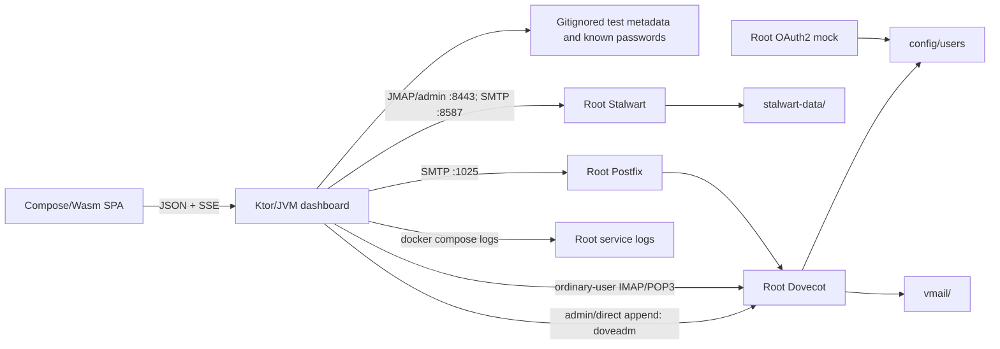

# Debug Dashboard Single-Stack Provider Integration — Design Specification

**Date:** 2026-08-10

**Status:** Approved architecture; independent written-spec review passed

**Target:** `debug-dashboard/` and the repository-root Docker Compose mail sandbox

**Supersedes:** The isolated-provider runtime, generated Dovecot eligibility authority,
Dovecot operator credential path, and Stalwart AppPassword lifecycle described in
`2026-07-23-debug-dashboard-design.md`. The all-Kotlin application architecture,
provider-native behavior, requested workflow coverage, and approved visual design remain
in force.

## 1. Goal

Make the dashboard an administrative and diagnostic client for the repository's existing
Dovecot/Postfix/OAuth2 and Stalwart services. The dashboard must show and mutate the real
accounts and mailboxes already present in this sandbox. It must not start or maintain a
second provider universe.

This is a trusted, loopback-only developer test tool. Its job is to reproduce email-client
and provider behavior, including authentication failures. Production credential isolation,
rotation, recovery workflows, and privilege separation are explicitly unnecessary.

The dashboard remains unusable until all originally requested account, folder, message,
mail-operation, delivery, password, deletion, and log workflows pass against both normal
provider instances.

## 2. Problem Being Corrected

The current dashboard launcher creates an isolated Compose project for Dovecot, Postfix,
and OAuth2 and starts a separate Stalwart gate fixture. It therefore reads different account
authorities, mail stores, ports, and logs from the normal sandbox:

| Boundary | Dashboard currently uses | Required target |
|---|---|---|
| Dovecot accounts | `debug-dashboard/.runtime/local-providers/dovecot/users` | `config/users` |
| Dovecot mail | `debug-dashboard/.runtime/local-providers/vmail` | `vmail/` |
| SMTP delivery | isolated Postfix on host port `21025` | root Postfix on host port `1025` |
| Logs | Compose project `mail-sandbox-dashboard` | root Compose project and services |
| Stalwart | gate store under `.runtime/stalwart-gate0b` | root `stalwart-data/` |

The earlier dashboard work also deleted the tracked `config/users` fixture. Its nine
records remain recoverable from Git and every record used the public test password
`secret`. The matching Maildirs under `vmail/` still exist.

The root Stalwart runtime has a second mismatch: the existing running instance is from the
older OIDC-only model, while the dashboard adapter targets the approved current registry
and ordinary password-backed JMAP model. This must be handled as an in-place upgrade of
the existing root store, not by substituting a new store.

## 3. Design Principles

1. **One provider stack.** Root Docker Compose services are the only interactive runtime.
2. **Provider-native truth.** Dovecot and Stalwart own account existence and mailbox state.
3. **No implicit synchronization.** Divergence between providers is valid diagnostic state.
4. **Simple, known test credentials.** Plaintext local fixtures are intentional.
5. **Startup preserves state.** Initialization is create-if-absent; reset is always explicit.
6. **Test as the ordinary user.** Mail and authentication probes use the account credential,
   not an administrative impersonation path.
7. **Current, reproducible dependencies.** Target the newest stable release verified at
   implementation time and pin its exact version and digest. A fallback to an older stable
   release requires fresh, explicit user approval after the incompatibility is demonstrated.

## 4. Runtime Architecture



The Ktor and Compose/Wasm boundaries do not change. All provider routing does:

- every Compose command runs from the repository root against only
  `docker-compose.yml`;
- no product-runtime command supplies the dashboard provider overlay or gate fixture;
- Dovecot account administration, verification, diagnostics, and explicitly labeled direct
  append execute an allowlisted `doveadm` command in the normal `dovecot` service;
- user-facing Dovecot folder, message, and basic mail operations use ordinary-account IMAP;
- POP3 is an authentication and retrieval probe because it has no folder, move, copy, or
  flag model;
- Dovecot delivery uses normal Postfix;
- Stalwart management, JMAP mail, and SMTP use the normal root Stalwart service;
- logs come from the same root services the developer's email client is exercising.

Acceptance fixtures may continue to create throwaway Compose projects. They are test
harnesses only and cannot be selected by normal dashboard wiring.

## 5. Dovecot Account Authority

### 5.1 Active and default files

`config/users` is restored as the single mutable Dovecot account authority. It remains
gitignored so dashboard account changes do not dirty the repository.

A tracked `config/users.defaults` contains the recovered addresses and passwords normalized
to the current canonical eight-field passwd-file grammar. The six fields after the password
are intentionally empty because Dovecot configuration supplies UID, GID, and home defaults:

```text
dev@local.test:{PLAIN}secret::::::
dev1@local.test:{PLAIN}secret::::::
dev2@local.test:{PLAIN}secret::::::
dev3@local.test:{PLAIN}secret::::::
dev4@local.test:{PLAIN}secret::::::
dev5@local.test:{PLAIN}secret::::::
a_very_long-email_for_testing@local.test:{PLAIN}secret::::::
inline_img@local.test:{PLAIN}secret::::::
inline_msg@local.test:{PLAIN}secret::::::
```

The launcher copies `config/users.defaults` to `config/users` with mode `0600` only when
`config/users` does not exist. An existing empty file is intentional and must not be
repopulated. Startup never compares, merges, or overwrites the active file.

The non-destructive account reset is
`debug-dashboard/reset-local-accounts.sh --dovecot-defaults`. It takes the shared users-file
lock and replaces only `config/users`; it never changes `vmail/` or `stalwart-data/`.
Interactive use requires an exact confirmation naming `config/users`; automation requires
the explicit `--yes` flag. The existing `scripts/reset.py` remains a separate whole-sandbox
destructive tool and must be repaired to require `--destroy-all-provider-data` plus a clear
confirmation before deleting any mailbox store. The dashboard never invokes it.

### 5.2 Consumers and mutations

Dovecot passwd-file authentication and userdb, the OAuth2 mock's eligibility checks, the
legacy Python account scripts, and the dashboard all consume this same file and the same
eight-field grammar. There is no generated hashed eligibility copy.

The root Compose file mounts the whole `config/` directory into Dovecot and the OAuth2 mock
at service-specific read-only paths. Directory-level mounts are required so atomic host
replacement of `config/users` remains visible inside both containers. Dovecot and OAuth2
configuration point to the mounted active file. The OAuth parser is simplified to accept
the approved `{PLAIN}` test scheme while retaining strict record, address, file-mode, and
duplicate validation.

Every host-side writer—including the dashboard, Python account helpers, bootstrap, and
non-destructive reset—uses the same `config/users.lock`. Kotlin uses `FileChannel.lock` and
Python uses `fcntl.lockf`, so both use an interoperable POSIX record lock. Each writer:

1. takes the shared lock;
2. validate and read the current records;
3. write a complete temporary file in the same directory;
4. atomically replace `config/users`;
5. flush/reload Dovecot authentication state when required by the current server version;
6. verifies the resulting account projection with normal `doveadm`.

Legacy helpers are migrated from fixed container names to root `docker compose exec`.
Any legacy mutation path that cannot honor the shared lock and atomic replacement contract
is retired rather than retained as an unsafe second writer.

The default and normal password-change scheme is `{PLAIN}`. Scheme-prefixed hashes may be
accepted later when a hash-specific issue needs reproduction, but they are not part of the
ordinary workflow.

Deleting Dovecot authentication does not silently delete the account's Maildir. Mailbox
purging remains a separate, explicit provider-specific choice.

## 6. Stalwart Account Authority and Upgrade

### 6.1 Preserve the existing store

`stalwart-data/` remains the only Stalwart store. It must never be deleted, replaced with
the gate store, or implicitly reseeded.

Migration is an explicit one-time operation under the existing fail-closed migration
runbook. Ordinary dashboard startup may detect that migration is required and report
**Stalwart upgrade required**, but it must not stop, copy, upgrade, or restore
`stalwart-data/`. The explicit migration command must:

1. stop Stalwart cleanly;
2. create a recoverable local snapshot of `stalwart-data/`;
3. rehearse and validate the upgrade against a disposable copy;
4. upgrade the original store only after the rehearsal succeeds and the operator confirms
   the displayed source version, target version, and snapshot path;
5. retain the snapshot until live acceptance passes;
6. on a partial real-store failure, stop Stalwart, retain both the failed store and snapshot,
   and require an explicit rollback command and confirmation; it never auto-restores.

The implementation first verifies the newest stable Stalwart release from official
sources. It pins that release's tag and image digest. If it cannot satisfy the approved
JMAP registry, ordinary password, SMTP, or data-migration contract, implementation stops,
reports the exact incompatibility, and asks the user whether an older stable release may be
used. No fallback is authorized by this spec. Pre-release, nightly, or unreleased source
versions are not "latest stable"; if one is numerically newer, the final dependency report
explains that distinction.

### 6.2 Authentication model

The upgraded normal instance uses its internal account directory with ordinary password
credentials. Password reset therefore changes the credential an email client actually
uses. Stalwart's supported built-in OAuth flow may remain available as an additional test
path; an external OIDC directory must not be the sole account authority.

One fixed, protected test management identity receives only the permissions needed for
domain and account listing/CRUD. It is always excluded from ordinary account lists and
cannot be changed or deleted through dashboard account actions. Prefer a normal password
such as `secret`. If the verified current
Stalwart API requires an API-key credential for these operations, use one static,
gitignored test key. Do not implement credential rotation, recovery generations,
AppPassword enrollment, encryption-at-rest, or a management credential lifecycle.

The normal service publishes JMAP/admin HTTP on `127.0.0.1:8443` and authenticated SMTP
submission on `127.0.0.1:8587`. Debug tracing writes to normal container output so the
dashboard's log view observes the same provider.

### 6.3 Existing accounts with unknown passwords

The dashboard enumerates the live Stalwart registry on every refresh. A live account is
shown even when the dashboard has no known plaintext password.

Management operations remain available for such an account. Mail, SMTP, and ordinary-user
authentication operations show **Password required** and offer either:

- supply and verify the existing password, then remember it in the local catalog; or
- reset the account to a new known test password.

Both successful paths persist the verified plaintext test password in the gitignored
catalog. A supplied password is never stored before an ordinary-user JMAP authentication
succeeds; a reset password is stored only after the provider confirms the change and the
new ordinary-user login succeeds. The dashboard never assumes that an existing account
uses `secret` merely because its address appears in a default fixture.

Each provider instance exposes one credential readiness value in the shared contract:

- `ready`: a known password most recently passed an ordinary-user authentication probe;
- `passwordRequired`: the live account has no known password;
- `authenticationFailed`: the remembered password no longer authenticates;
- `providerUnavailable`: readiness cannot currently be verified.

Mail actions require `ready`; management actions do not. The password adoption/reset API
returns the updated readiness and a safe provider receipt.

## 7. Dashboard Catalog

The gitignored dashboard catalog is a convenience cache, not account authority. It may
store:

- provider account ID and canonical address;
- a last-known capability snapshot for rendering while a provider is unavailable;
- the known ordinary plaintext test password;
- safe UI metadata such as the last selected provider.

Live provider capabilities always override the cached snapshot. Records are keyed by
provider plus immutable provider account ID where available. The same
email address on Dovecot and Stalwart remains one logical account with independent provider
instances. Deleting or losing the catalog cannot make a live provider account disappear
from the dashboard; it only changes the account to **Password required** where necessary.

There is no encryption, rotation, quarantine, leased-secret, or crash-recovery protocol for
this file. It is gitignored and contains disposable local test values.

## 8. Provider Capabilities and Authentication Reproduction

Provider and protocol selections must describe behavior enforced by the provider:

- Dovecot accounts expose IMAP for folder/message operations, POP3 for authentication and
  retrieval probes, and Postfix as the SMTP delivery path.
- Stalwart accounts expose the JMAP and SMTP permissions configured on the real account.
- An unsupported or server-wide capability is not represented as a per-account toggle.

The dashboard has a control plane and a test plane:

- **Control plane:** account projection, `doveadm` verification/direct append, Dovecot
  passwd-file mutation, and Stalwart management calls.
- **Test plane:** Dovecot folder/message operations over ordinary-account IMAP plus explicit
  IMAP/POP3/SMTP/JMAP/OAuth requests using the selected
  account credential and returning the provider response plus correlated logs.

Administrative success never substitutes for an ordinary-account authentication test.
This separation lets a developer reproduce wrong-password, missing-account, disabled
permission, stale credential, and OAuth-token failures without production security
machinery obscuring the provider behavior.

## 9. Lifecycle and State Preservation

`debug-dashboard/start-local.sh` performs only these provider actions:

1. create TLS fixtures if absent;
2. create `config/users` from defaults if absent;
3. classify Stalwart state as fresh, migration-current, or migration-required;
4. rebuild only the local `oauth2-mock` image, then run root `docker compose up -d` for
   Dovecot, Postfix, and OAuth2 without forcing a Postfix rebuild;
5. initialize and receipt a genuinely absent/empty Stalwart store with the current version,
   or start a non-empty store only when its migration receipt is current;
6. probe each service independently without requiring every service to become healthy;
7. build and start the dashboard in normal or degraded mode.

It does not reset accounts, copy data from one provider to another, start a provider
overlay, create a gate store, or perform a Stalwart migration. It must converge safe,
already-migrated services to the root Compose definition rather than accepting any running
container as sufficient. A provider failure or required Stalwart migration appears as an
actionable readiness state; it does not prevent the dashboard from diagnosing other
providers.

Stopping the dashboard stops only the dashboard process. Provider lifecycle remains the
normal root Compose lifecycle. A separately named reset command handles explicit fixture
restoration; reset is never an option hidden inside ordinary stop behavior.

The following paths are preservation boundaries:

- `config/users`;
- `vmail/`;
- `stalwart-data/`;
- unrelated files under `debug-dashboard/.runtime/`.

No startup, migration, acceptance cleanup, or account refresh may broadly delete or
replace them.

## 10. Data Flow and Failure Handling

### Account refresh

1. list Dovecot users from the active passwd file/provider;
2. query the live Stalwart account registry;
3. join by canonical address into logical accounts;
4. overlay catalog metadata without filtering provider records;
5. report provider-specific readiness and errors independently.

When a provider is unavailable, its last-known catalog metadata may remain visible but is
explicitly stale. It never overrides a successful live query and never manufactures a live
account.

### Mutations

Dual-provider operations are itemized, not transactional fiction. If Dovecot succeeds and
Stalwart fails, the response reports both outcomes and preserves the divergence for retry
or diagnosis. The dashboard does not roll back a successful provider mutation unless that
provider offers an explicit, verified inverse requested by the user.

### Startup and migration failures

- a missing `config/users` is initialized; an unreadable or malformed existing file is an
  actionable startup error and is not replaced;
- a failed Stalwart rehearsal leaves the real store untouched;
- a failed real-store upgrade stops Stalwart, retains the failed store and snapshot, and
  leaves the dashboard available in degraded mode;
- an unavailable provider does not cause its accounts to be removed from the other
  provider or from persistent provider state;
- error messages identify the actual service, endpoint, command, and safe provider receipt.

## 11. Testing and Acceptance

Implementation follows test-first development for behavior changes.

### Automated contract tests

- the normal Dovecot adapter cannot select the overlay Compose file or isolated project;
- all Dovecot admin/direct-append and log commands address the root service;
- user-facing Dovecot folder and message operations authenticate over normal IMAP;
- Dovecot bootstrap is create-if-absent and preserves an empty or modified active file;
- atomic passwd-file mutations preserve unrelated records;
- OAuth eligibility and legacy scripts use the canonical eight-field `config/users`;
- every passwd-file writer shares `config/users.lock` and atomic replacement;
- Stalwart product wiring uses `:8443`, normal SMTP, and the normal management credential;
- live Stalwart accounts appear without catalog credentials;
- credential readiness distinguishes ready, password-required, failed-auth, and unavailable;
- adopting or resetting a Stalwart password stores it only after ordinary authentication;
- startup and stop scripts never reference gate or local-provider product runtimes;
- the dashboard catalog cannot hide a provider account;
- provider/protocol claims match actual enforced capabilities.

### Migration proof

The current root Stalwart store is upgraded only after the same operation passes against a
copy. The proof verifies account inventory, JMAP discovery, ordinary-password login,
management CRUD, SMTP submission, and store restart before and after migration.

### Live usability acceptance

Against the normal root services, the suite must verify every requested workflow on both
provider profiles:

1. server and account-related logs;
2. pre-existing account discovery;
3. account create with valid capabilities;
4. EML, authored text, and deterministic random message creation/delivery;
5. folder list/create/delete;
6. message list/read;
7. ordinary-account password change and authentication with the new password;
8. account deletion;
9. read/unread, flag/unflag, copy, move, trash, and permanent delete.

The suite also performs explicit ordinary-account authentication probes and confirms that
their attempts appear in the normal service logs. Cleanup is limited to uniquely generated
acceptance accounts and folders. It never resets the complete passwd file, `vmail/`, or
`stalwart-data/`.

If `config/users` was absent at bootstrap, the recovered nine Dovecot defaults must be
visible after acceptance. If it existed—even empty—the pre-acceptance Dovecot account set
must be preserved except for uniquely generated acceptance records. All pre-existing
ordinary Stalwart accounts must remain visible after acceptance; protected management
identities remain intentionally excluded from the account workspace.

## 12. Dependency Policy

Before changing a toolchain, library, or provider image, implementation checks the official
stable release source. The newest stable release is the required target and is pinned. A
freshness test or documented check prevents an unreviewed `latest` tag from drifting.

When a numerically newer artifact is not selected because it is a pre-release, nightly, or
not a published dependency for the required target, the handoff names it and explains that
distinction. If the newest stable release is incompatible, work stops for user direction;
an older stable release is never chosen silently or merely because it is compatible.

## 13. Documentation Consequences

The implementation updates:

- root setup, connection, account, and log instructions;
- the Docker Compose service and volume maps;
- Dovecot authentication documentation;
- Stalwart configuration, migration, and admin instructions;
- dashboard start/stop/reset behavior;
- the dependency/version rationale;
- the original dashboard design spec with a prominent supersession link.

References to `mail-sandbox-dashboard`, ports `21025`, `18443`, or `18587`, the product
Stalwart gate store, generated Dovecot eligibility hashes, Dovecot operator credentials,
encrypted AppPassword storage, or automatic Dovecot-to-Stalwart synchronization must not
remain as descriptions of the normal interactive runtime.

## 14. Non-Goals

- production deployment or external users;
- multi-user dashboard authorization;
- encrypted local test credentials;
- credential rotation or recovery ceremonies;
- provider impersonation;
- continuous reconciliation between Dovecot and Stalwart;
- silently upgrading across an unverified provider data format;
- deleting existing mail data to make tests pass;
- redesigning the approved dashboard visual system.

## 15. Completion Criteria

This corrective work is complete only when:

- when `config/users` is missing, bootstrap restores the nine recoverable accounts and
  passwords in canonical current format without deleting Maildirs; when it already exists,
  bootstrap preserves it byte-for-byte;
- the dashboard lists existing Dovecot and Stalwart accounts from live provider state;
- all interactive operations use only the normal root services and data stores;
- the existing Stalwart store is upgraded in place with a retained recovery snapshot;
- ordinary password changes and authentication probes work on both providers;
- the complete two-provider live usability acceptance suite passes;
- startup preserves intentionally divergent or broken authentication state;
- dependency versions are the newest stable releases, or a user-approved exception is
  recorded after a demonstrated incompatibility;
- unrelated user changes remain untouched.
